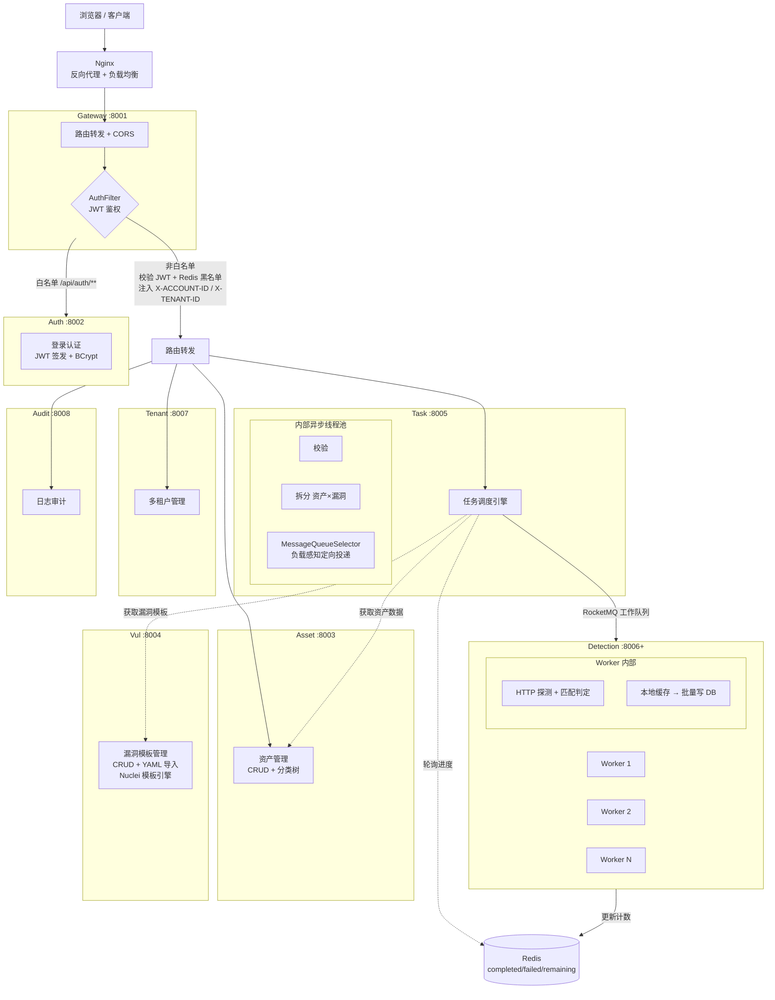
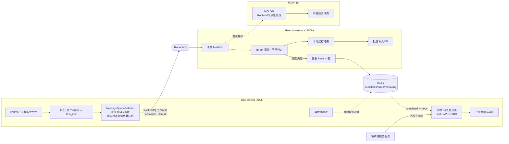
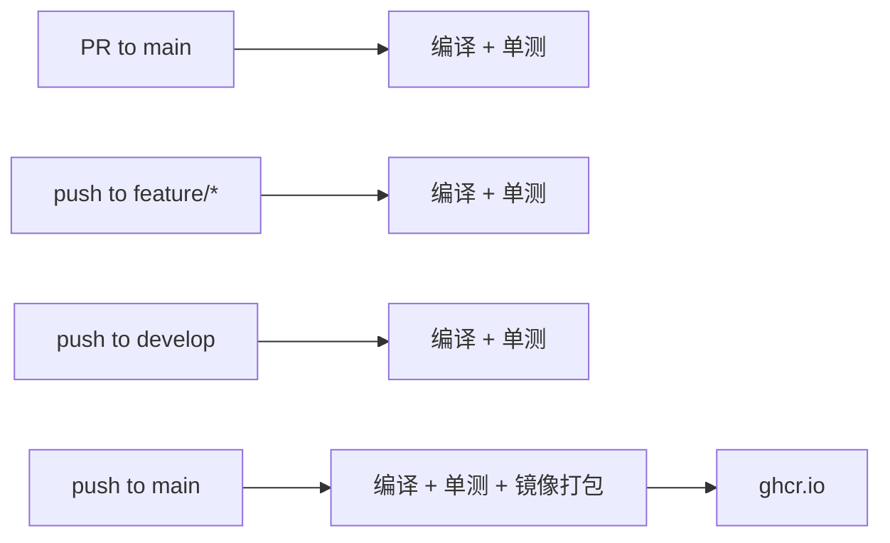

# Hawkeye Cloud

分布式漏洞检测平台 —— 基于 Java 21 + Spring Cloud 微服务架构，支持 SaaS 多租户与私有化部署。


## 技术栈

| 类别 | 技术 | 版本 |
|------|------|------|
| 语言 | Java | 21 |
| 框架 | Spring Boot | 4.0.5 |
| 微服务 | Spring Cloud + Spring Cloud Alibaba (Nacos) | 2025.1.0 |
| ORM | MyBatis-Plus | 3.5.15 |
| 数据库 | MySQL + Druid | 9.1.0 |
| 缓存 | Redis / Redisson / Lettuce | - |
| 消息队列 | Apache RocketMQ (Spring Boot Starter) | 2.3.2 |
| 分布式事务 | Seata | 2.1.0 |
| 流量控制 | Sentinel | 2.0.2 |
| API 文档 | Knife4j | 4.4.0 |
| 对象映射 | MapStruct | 1.6.3 |
| JWT | JJWT | 0.12.6 |
| 测试 | JUnit 5 + Mockito + Testcontainers | - |
| 容器 | Docker + Docker Compose | - |
| CI/CD | GitHub Actions | - |

## 架构概览



### 核心检测链路



## 项目结构

```
hawkeye-cloud/
├── .github/workflows/               # CI/CD 流水线
├── common-service/common-utils/     # 公共基础设施（统一响应、多租户、分页、异常、日志切面）
├── gateway-service/                 # API 网关 (:8001)
├── auth-service/                    # 认证服务 (:8002)
├── asset-service/                   # 资产服务 (:8003)
├── vul-service/                     # 漏洞管理服务 (:8004)
├── docker-compose.yml               # 容器编排
├── task-service/                    # 任务调度服务 (:8005)
├── detection-service/               # 检测执行服务 (:8006+)
├── tenant-service/                  # 租户管理服务 (:8007)
├── audit-service/                   # 日志审计服务 (:8008)
├── ddocs/                           # 项目文档
└── pom.xml                          # 根 POM（聚合工程）
```

每个微服务内部按 `common → business → api → bootstrap` 四层分包，依赖单向，职责清晰。

## 快速开始

**方式一：Docker Compose 一键启动（推荐）**

```bash
# 打包 jar
mvn clean package -DskipTests

# 启动全部：MySQL + Redis + Nacos + 4 个微服务
docker compose up -d

# 网关入口：http://localhost:8000
# Nacos 控制台：http://localhost:8848/nacos
```

服务启动顺序由 `depends_on` + `healthcheck` 自动编排，无需手动干预。

**方式二：本地启动**

前置条件：JDK 21、Maven 3.9+、MySQL 9.1、Redis、Nacos 2.x

```bash
# 编译全部模块
mvn clean compile

# 运行测试
mvn test

# 打包
mvn clean package -DskipTests

# 启动各服务（按顺序）
mvn -pl gateway-service/gateway-bootstrap spring-boot:run     # 网关 :8001
mvn -pl auth-service/auth-bootstrap spring-boot:run           # 认证 :8002
mvn -pl asset-service/asset-bootstrap spring-boot:run         # 资产 :8003
mvn -pl vul-service/vul-bootstrap spring-boot:run             # 漏洞 :8004
```

仅使用 `dev` profile 启动，本地 Nacos 地址 `localhost:8848`。

## CI/CD

项目使用 GitHub Actions 自动构建流水线：



镜像仓库：[GitHub Container Registry](https://github.com/spojchil?tab=packages)

## 容器镜像

## 容器镜像

| 服务 | 镜像 |
|------|------|
| Gateway | `ghcr.io/spojchil/hawkeye-gateway:latest` |
| Auth | `ghcr.io/spojchil/hawkeye-auth:latest` |
| Asset | `ghcr.io/spojchil/hawkeye-asset:latest` |
| Vul | `ghcr.io/spojchil/hawkeye-vul:latest` |

## 开发进度

| 模块 | 状态 | 说明 |
|------|------|------|
| common-service | ✅ 完成 | 统一响应、多租户、分页、异常、日志切面 |
| gateway-service | ✅ 完成 | JWT 鉴权过滤器、路由转发、CORS、Redis 黑名单 |
| auth-service | ✅ 完成（基础） | 登录认证、JWT 签发、BCrypt 密码加密 |
| asset-service | ✅ 完成 | 资产 CRUD + 分类树管理，11 个 API 端点 |
| vul-service | ✅ 基础配置 | 启动类 + Nacos 注册 + 数据源，业务待开发 |
| task-service | 📝 规划中 | 任务调度：提交 → 拆分 → 分发 |
| detection-service | 📝 规划中 | 检测 Worker：HTTP 探测 + 判定引擎 |
| tenant-service | 📝 规划中 | 多租户管理 |
| audit-service | 📝 规划中 | 操作日志审计 |

## 项目亮点

- **异步任务调度引擎**：task-service 内部线程池编排（校验 → 拆分 → 分发）+ RocketMQ 工作队列 + 原生死信
- **智能负载感知分发**：Worker 实时上报负载至 Redis，MessageQueueSelector 定向投递
- **Java 21 虚拟线程**：Worker 高并发 HTTP 探测，I/O 密集型场景优势显著
- **策略模式检测引擎**：不同漏洞类型对应不同匹配策略，符合开闭原则
- **零侵入多租户**：MyBatis-Plus TenantLineHandler + ThreadLocal，业务代码无需感知
- **JWT 全链路鉴权**：网关统一校验 + Redis 黑名单，支持 Token 主动失效
- **统一异常体系**：ApiResponse + ApiException + ErrorCode + 全局异常拦截

## 详细文档

- [项目概览](docs/项目概览.md)
- [架构设计](docs/架构设计.md)
- [模块说明](docs/模块说明.md)
- [任务调度系统架构](docs/任务调度系统架构.md)

## 漏洞模板库

本平台使用 [projectdiscovery/nuclei-templates](https://github.com/projectdiscovery/nuclei-templates) 的 HTTP 模板库，平台上线即可获得 **10,000+** 现成检测模板，覆盖 CVE、信息泄露、配置错误、未授权访问等主流漏洞类型。

## 许可证

本项目基于 [MIT License](LICENSE) 开源。

nuclei-templates 模板库同样基于 [MIT License](https://github.com/projectdiscovery/nuclei-templates/blob/main/LICENSE.md) 授权使用。
