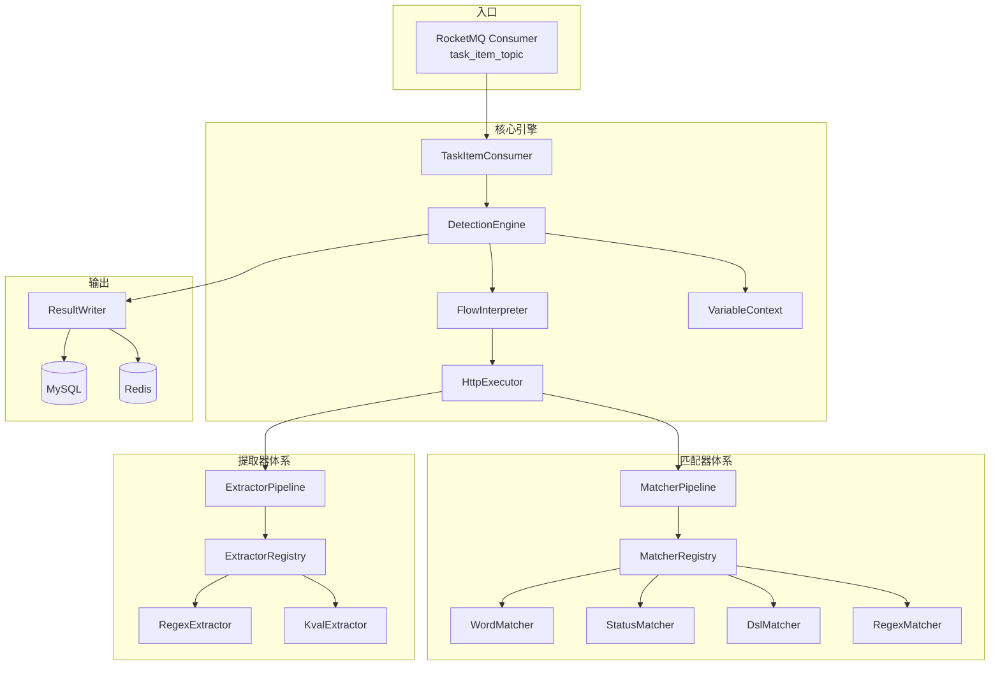

# Detection-Service 架构设计 v3.1

> 纯 Worker 执行引擎。从 RocketMQ 消费消息，执行 HTTP 探测 + 匹配 + 提取 + DSL 判定，批量写结果。
> 不暴露 REST 接口，零外部 Feign 调用。
> 端口：`:8006`（健康检查 + Nacos 注册）

---

## 一、整体架构



**核心原则**：每种能力（匹配方式、提取方式）都是可插拔的 `@Component`。新增一种策略 = 写一个类，不改任何已有文件。

---

## 二、模块结构

```
detection-service/
├── detection-common/               # 公共层
│   ├── enums/
│   │   └── DetectionStatusEnum.java
│   └── pojo/
│       ├── dto/
│       │   └── TaskItemMessage.java    # 消息体
│       └── entity/
│           └── DetectionResult.java    # 检测结果实体
│
├── detection-business/             # 业务层
│   ├── consumer/
│   │   └── TaskItemConsumer.java       # RocketMQ 消费者
│   ├── engine/
│   │   ├── DetectionEngine.java        # 核心编排引擎
│   │   ├── FlowInterpreter.java        # 流程解释器
│   │   ├── HttpExecutor.java           # HTTP 执行器
│   │   ├── VariableContext.java         # 变量上下文
│   │   ├── MatcherPipeline.java        # 匹配器编排
│   │   ├── MatcherRegistry.java        # 匹配器注册表
│   │   ├── ExtractorPipeline.java      # 提取器编排
│   │   ├── ExtractorRegistry.java      # 提取器注册表
│   │   ├── ResultWriter.java           # 结果批量写入
│   │   ├── matcher/
│   │   │   ├── Matcher.java            # 匹配器接口
│   │   │   ├── AbstractMatcher.java    # 抽象基类
│   │   │   ├── WordMatcher.java        # 关键词匹配
│   │   │   ├── StatusMatcher.java      # 状态码匹配
│   │   │   ├── DslMatcher.java         # DSL 匹配
│   │   │   └── RegexMatcher.java       # 正则匹配
│   │   ├── extractor/
│   │   │   ├── Extractor.java          # 提取器接口
│   │   │   ├── RegexExtractor.java     # 正则提取
│   │   │   └── KvalExtractor.java      # 键值提取
│   │   └── model/
│   │       ├── HttpRequestConfig.java
│   │       ├── HttpResponseContext.java
│   │       ├── MatcherDef.java
│   │       └── ExtractorDef.java
│   └── mapper/
│       └── DetectionResultMapper.java
│
└── detection-bootstrap/            # 启动层
    └── resources/
        └── application.yml
```

---

## 三、消息体设计

### 3.1 TaskItemMessage

```java
@Data
public class TaskItemMessage implements Serializable {
    // 任务标识
    private Long taskId;
    private Long itemId;
    private Long tenantId;
    private Long createdAt;
    
    // 资产信息（VariableContext 用）
    private String assetProtocol;       // http / https
    private String assetHost;           // example.com
    private Integer assetPort;          // 443
    private String assetPath;           // /api
    
    // 模板检测配置
    private String templateId;          // YAML 业务 ID
    private Long templateDbId;          // DB 主键
    private String flow;                // 执行流表达式
    private Map<String, Object> variables;
    private List<HttpStep> httpSteps;
    
    @Data
    public static class HttpStep {
        private Integer stepOrder;
        private String method;
        private List<String> path;
        private Map<String, String> headers;
        private String body;
        private String raw;
        private String attack;
        private String matchersCondition;
        private List<Matcher> matchers;
        private List<Extractor> extractors;
    }
    
    @Data
    public static class Matcher {
        private String type;
        private String part;
        private String condition;
        private Boolean negative;
        private Boolean caseInsensitive;
        private Map<String, Object> config;
    }
    
    @Data
    public static class Extractor {
        private String type;
        private String part;
        private String name;
        private Map<String, Object> config;
        private Boolean internal;
        private Integer groupNum;
    }
}
```

**消息体大小**：单模板平均 ~1.5KB JSON，5000 条 ≈ 7.5MB，对 RocketMQ 完全可接受。

---

## 四、检测结果实体

### 4.1 DetectionResult

```java
@Data
@TableName("detection_result")
public class DetectionResult {
    @TableId(type = IdType.AUTO)
    private Long resultId;
    
    private Long taskId;
    private Long taskItemId;
    private Long templateId;
    private Long assetId;
    
    private String status;          // matched / not_matched / error
    private Integer responseStatusCode;
    private Integer responseSize;
    private String responseSummary;
    private String matchedMatcher;
    private LocalDateTime matchedAt;
    private String errorMessage;
    private Integer durationMs;
    
    private Long tenantId;
    private LocalDateTime createTime;
}
```

### 4.2 DDL

```sql
CREATE TABLE IF NOT EXISTS `detection_result`
(
    `result_id`             BIGINT UNSIGNED AUTO_INCREMENT COMMENT '主键',
    `task_id`               BIGINT UNSIGNED  NOT NULL COMMENT '任务 ID',
    `task_item_id`          BIGINT UNSIGNED  NOT NULL COMMENT '检测项 ID',
    `template_id`           BIGINT UNSIGNED  NOT NULL COMMENT '模板 ID',
    `asset_id`              BIGINT UNSIGNED  NOT NULL COMMENT '资产 ID',
    `status`                VARCHAR(20)      NOT NULL COMMENT '状态: matched/not_matched/error',
    `response_status_code`  INT COMMENT 'HTTP 响应状态码',
    `response_size`         INT COMMENT '响应体大小',
    `response_summary`      TEXT COMMENT '响应摘要',
    `matched_matcher`       VARCHAR(500) COMMENT '匹配到的规则',
    `matched_at`            DATETIME COMMENT '匹配时间',
    `error_message`         VARCHAR(1000) COMMENT '错误信息',
    `duration_ms`           INT COMMENT '执行耗时(ms)',
    `tenant_id`             BIGINT UNSIGNED  NOT NULL DEFAULT 0 COMMENT '租户ID',
    `create_time`           DATETIME         NOT NULL DEFAULT CURRENT_TIMESTAMP COMMENT '创建时间',
    PRIMARY KEY (`result_id`),
    UNIQUE KEY `uk_task_item` (`task_item_id`),
    KEY `idx_task_id` (`task_id`),
    KEY `idx_template_id` (`template_id`),
    KEY `idx_asset_id` (`asset_id`),
    KEY `idx_status` (`status`),
    KEY `idx_tenant` (`tenant_id`)
) ENGINE = InnoDB DEFAULT CHARSET = utf8mb4 COLLATE = utf8mb4_general_ci COMMENT ='检测结果表';
```

---

## 五、核心引擎

### 5.1 DetectionEngine

```java
@Component
public class DetectionEngine {
    
    private final HttpExecutor httpExecutor;
    private final MatcherPipeline matcherPipeline;
    private final ExtractorPipeline extractorPipeline;
    private final FlowInterpreter flowInterpreter;
    private final ResultWriter resultWriter;
    
    @LogExecutionTime
    public void execute(TaskItemMessage msg) {
        DetectionResult result = new DetectionResult();
        result.setTaskId(msg.getTaskId());
        result.setTaskItemId(msg.getItemId());
        result.setTemplateId(msg.getTemplateDbId());
        result.setAssetId(msg.getAssetId());  // 必须设置 assetId
        
        try {
            if (msg.getHttpSteps() == null || msg.getHttpSteps().isEmpty()) {
                writeError(result, "消息中无 HTTP 步骤");
                return;
            }
            
            VariableContext vars = new VariableContext(msg);
            boolean matched = flowInterpreter.execute(msg.getHttpSteps(), msg.getFlow(),
                    step -> executeStep(step, vars));
            
            result.setStatus(matched ? "matched" : "not_matched");
            Object dur = vars.get("duration");
            result.setDurationMs(dur instanceof Long d ? d.intValue() : 0);
            if (matched) result.setMatchedAt(LocalDateTime.now());
            resultWriter.write(result);
            
        } catch (InterruptedException e) {
            Thread.currentThread().interrupt();  // 恢复中断状态
            writeError(result, "检测被中断");
        } catch (Exception e) {
            log.error("检测异常 taskId={} itemId={}", msg.getTaskId(), msg.getItemId(), e);
            writeError(result, e.getMessage() != null ? e.getMessage() : "内部错误");
        }
    }
    
    private boolean executeStep(HttpStep step, VariableContext vars) {
        HttpRequestConfig config = new HttpRequestConfig();
        config.setMethod(step.getMethod());
        config.setPaths(step.getPath());
        config.setHeaders(step.getHeaders());
        config.setBody(step.getBody());
        config.setRaw(step.getRaw());
        
        HttpResponseContext ctx;
        try {
            if (config.getRaw() != null && !config.getRaw().isBlank()) {
                ctx = httpExecutor.executeRaw(config.getRaw(), vars);
            } else {
                ctx = httpExecutor.execute(config, vars);
            }
        } catch (IOException | InterruptedException e) {
            if (e instanceof InterruptedException) {
                Thread.currentThread().interrupt();
            }
            throw new RuntimeException(e);
        }
        
        vars.updateFrom(ctx);
        
        if (step.getExtractors() != null && !step.getExtractors().isEmpty()) {
            List<ExtractorDef> defs = step.getExtractors().stream()
                    .map(this::toExtractorDef)
                    .toList();
            extractorPipeline.extract(ctx, defs, vars);
        }
        
        if (step.getMatchers() != null && !step.getMatchers().isEmpty()) {
            List<MatcherDef> defs = step.getMatchers().stream()
                    .map(this::toMatcherDef)
                    .toList();
            return matcherPipeline.evaluate(ctx, defs,
                    step.getMatchersCondition() != null ? step.getMatchersCondition() : "or");
        }
        return false;
    }
    
    private void writeError(DetectionResult result, String msg) {
        result.setStatus("error");
        result.setErrorMessage(msg);
        resultWriter.write(result);
    }
}
```

### 5.2 FlowInterpreter

```java
@Component
public class FlowInterpreter {
    
    private static final Pattern STEP_REF = Pattern.compile("http\\((\\d+)\\)");
    
    /**
     * 执行流程。
     * null / 空 → 顺序执行全部步骤
     * "http(1) && http(2)" → AND 逻辑
     * "http(1) || http(2)" → OR 逻辑
     */
    public boolean execute(List<HttpStep> steps, String flow, StepExecutor executor) {
        if (flow == null || flow.isBlank()) {
            return sequential(steps, executor);
        }
        
        String expr = flow.trim();
        
        if (expr.contains("&&")) {
            return evaluateAnd(expr, steps, executor);
        }
        
        if (expr.contains("||")) {
            return evaluateOr(expr, steps, executor);
        }
        
        // 单步执行
        Matcher m = STEP_REF.matcher(expr);
        if (m.find()) {
            int stepIndex = Integer.parseInt(m.group(1)) - 1;
            if (stepIndex >= 0 && stepIndex < steps.size()) {
                return executor.execute(steps.get(stepIndex));
            }
        }
        
        return false;
    }
    
    private boolean sequential(List<HttpStep> steps, StepExecutor executor) {
        boolean lastResult = false;
        for (HttpStep step : steps) {
            lastResult = executor.execute(step);
        }
        return lastResult;
    }
    
    private boolean evaluateAnd(String expr, List<HttpStep> steps, StepExecutor executor) {
        Matcher m = STEP_REF.matcher(expr);
        while (m.find()) {
            int stepIndex = Integer.parseInt(m.group(1)) - 1;
            if (stepIndex >= 0 && stepIndex < steps.size()) {
                if (!executor.execute(steps.get(stepIndex))) {
                    return false;
                }
            }
        }
        return true;
    }
    
    private boolean evaluateOr(String expr, List<HttpStep> steps, StepExecutor executor) {
        Matcher m = STEP_REF.matcher(expr);
        while (m.find()) {
            int stepIndex = Integer.parseInt(m.group(1)) - 1;
            if (stepIndex >= 0 && stepIndex < steps.size()) {
                if (executor.execute(steps.get(stepIndex))) {
                    return true;
                }
            }
        }
        return false;
    }
    
    @FunctionalInterface
    public interface StepExecutor {
        boolean execute(HttpStep step);
    }
}
```

---

## 六、匹配器体系

### 6.1 策略接口

```java
public interface Matcher {
    /** 类型标识，对应 DB 中 vul_matcher.type */
    String type();
    
    /** 对 HTTP 响应执行匹配 */
    boolean match(HttpResponseContext ctx, MatcherDef def);
}
```

### 6.2 MatcherDef

```java
@Data
public class MatcherDef {
    private String type;              // word / status / dsl / regex
    private String part;              // body / header / all
    private String condition;         // and / or
    private boolean negative;
    private boolean caseInsensitive;
    private List<String> words;
    private List<Integer> status;
    private List<String> dsl;
    private List<String> regex;
}
```

### 6.3 注册表

```java
@Component
public class MatcherRegistry {
    private final Map<String, Matcher> map;
    
    public MatcherRegistry(List<Matcher> list) {
        this.map = list.stream()
                .collect(Collectors.toMap(Matcher::type, Function.identity()));
    }
    
    public Matcher get(String type) {
        return map.get(type);
    }
}
```

### 6.4 编排器

```java
@Component
public class MatcherPipeline {
    
    private final MatcherRegistry registry;
    
    public boolean evaluate(HttpResponseContext ctx, List<MatcherDef> defs, String outerCondition) {
        if (defs == null || defs.isEmpty()) return false;
        
        Predicate<MatcherDef> evaluator = def -> {
            Matcher m = registry.get(def.getType());
            if (m == null) {
                log.warn("未知的匹配器类型: {}", def.getType());
                return false;
            }
            boolean result = m.match(ctx, def);
            return def.isNegative() != result;
        };
        
        return "and".equals(outerCondition)
                ? defs.stream().allMatch(evaluator)
                : defs.stream().anyMatch(evaluator);
    }
}
```

### 6.5 实现清单

| 策略 | 类型 | 优先级 | 说明 |
|------|------|--------|------|
| `WordMatcher` | word | P0 | 关键词匹配 |
| `StatusMatcher` | status | P0 | 状态码匹配 |
| `DslMatcher` | dsl | P0 | DSL 表达式匹配 |
| `RegexMatcher` | regex | P0 | 正则匹配 |

### 6.6 WordMatcher 实现

```java
@Component
public class WordMatcher extends AbstractMatcher {
    
    @Override
    public String type() { return "word"; }
    
    @Override
    protected boolean evaluateInner(HttpResponseContext ctx, MatcherDef def) {
        String target = getTarget(ctx, def.getPart());
        if (target == null) return false;
        
        List<String> words = def.getWords();
        if (words == null || words.isEmpty()) return false;
        
        String comparison = def.isCaseInsensitive() ? target.toLowerCase() : target;
        
        return words.stream().anyMatch(word -> {
            String w = def.isCaseInsensitive() ? word.toLowerCase() : word;
            return comparison.contains(w);
        });
    }
}
```

### 6.7 RegexMatcher 实现（带缓存）

```java
@Component
public class RegexMatcher extends AbstractMatcher {
    
    private final ConcurrentHashMap<String, Pattern> patternCache = new ConcurrentHashMap<>();
    
    @Override
    public String type() { return "regex"; }
    
    @Override
    protected boolean evaluateInner(HttpResponseContext ctx, MatcherDef def) {
        String target = getTarget(ctx, def.getPart());
        if (target == null) return false;
        
        List<String> regexes = def.getRegex();
        if (regexes == null || regexes.isEmpty()) return false;
        
        return regexes.stream().anyMatch(regex -> {
            Pattern pattern = patternCache.computeIfAbsent(regex, 
                    r -> Pattern.compile(r, Pattern.DOTALL));
            return pattern.matcher(target).find();
        });
    }
}
```

---

## 七、提取器体系

### 7.1 策略接口

```java
public interface Extractor {
    /** 类型标识 */
    String type();
    
    /** 从 HTTP 响应中提取值 */
    String extract(HttpResponseContext ctx, ExtractorDef def);
}
```

### 7.2 注册表

```java
@Component
public class ExtractorRegistry {
    private final Map<String, Extractor> map;
    
    public ExtractorRegistry(List<Extractor> list) {
        this.map = list.stream()
                .collect(Collectors.toMap(Extractor::type, Function.identity()));
    }
    
    public Extractor get(String type) {
        return map.get(type);
    }
}
```

### 7.3 编排器

```java
@Component
public class ExtractorPipeline {
    
    private final ExtractorRegistry registry;
    
    public void extract(HttpResponseContext ctx, List<ExtractorDef> defs, VariableContext vars) {
        if (defs == null) return;
        
        for (ExtractorDef def : defs) {
            Extractor e = registry.get(def.getType());
            if (e == null) {
                log.warn("未知的提取器类型: {}", def.getType());
                continue;
            }
            
            String value = e.extract(ctx, def);
            if (value != null && def.getName() != null) {
                vars.set(def.getName(), value);
            }
        }
    }
}
```

### 7.4 实现清单

| 策略 | 类型 | 优先级 | 说明 |
|------|------|--------|------|
| `RegexExtractor` | regex | P0 | 正则提取 |
| `KvalExtractor` | kval | P1 | 键值提取 |

---

## 八、HTTP 执行器

### 8.1 设计要点

- 使用 Java 11+ 内置 `HttpClient`
- 支持 Simple（method + path + headers + body）和 Raw（原始 HTTP 文本）两种模式
- 连接池复用，超时控制
- URI 编码容错处理

### 8.2 实现

```java
@Component
public class HttpExecutor {
    
    private static final HttpClient CLIENT = HttpClient.newBuilder()
            .version(HttpClient.Version.HTTP_1_1)
            .connectTimeout(Duration.ofSeconds(5))
            .followRedirects(HttpClient.Redirect.NEVER)
            .build();
    
    private static final Duration REQUEST_TIMEOUT = Duration.ofSeconds(10);
    
    public HttpResponseContext execute(HttpRequestConfig config, VariableContext vars) 
            throws IOException, InterruptedException {
        List<String> paths = config.getPaths();
        if (paths == null || paths.isEmpty()) {
            paths = List.of("/");
        }
        
        HttpResponseContext lastResponse = null;
        for (String path : paths) {
            String resolvedPath = vars.resolve(path);
            URI uri = buildUri(resolvedPath);
            
            HttpRequest.Builder builder = HttpRequest.newBuilder()
                    .uri(uri)
                    .timeout(REQUEST_TIMEOUT);
            
            String method = config.getMethod() != null ? config.getMethod() : "GET";
            HttpRequest.BodyPublisher bodyPublisher = HttpRequest.BodyPublishers.noBody();
            if (config.getBody() != null && !config.getBody().isEmpty()) {
                String resolvedBody = vars.resolve(config.getBody());
                bodyPublisher = HttpRequest.BodyPublishers.ofString(resolvedBody);
            }
            builder.method(method, bodyPublisher);
            
            if (config.getHeaders() != null) {
                for (Map.Entry<String, String> entry : config.getHeaders().entrySet()) {
                    builder.header(entry.getKey(), vars.resolve(entry.getValue()));
                }
            }
            
            long start = System.currentTimeMillis();
            HttpResponse<String> response = CLIENT.send(builder.build(), 
                    HttpResponse.BodyHandlers.ofString());
            long duration = System.currentTimeMillis() - start;
            
            lastResponse = buildResponseContext(response, duration);
            
            if (response.statusCode() < 400) {
                return lastResponse;
            }
        }
        return lastResponse;
    }
    
    private URI buildUri(String path) throws IOException {
        try {
            return URI.create(path);
        } catch (IllegalArgumentException e) {
            // 尝试编码后构建
            try {
                // 分离 scheme、host、path
                int schemeEnd = path.indexOf("://");
                if (schemeEnd > 0) {
                    String scheme = path.substring(0, schemeEnd);
                    String rest = path.substring(schemeEnd + 3);
                    int pathStart = rest.indexOf('/');
                    if (pathStart > 0) {
                        String host = rest.substring(0, pathStart);
                        String pathPart = rest.substring(pathStart);
                        return new URI(scheme, host, pathPart, null);
                    }
                }
                return new URI(path);
            } catch (Exception ex) {
                throw new IOException("无法构建 URI: " + path, ex);
            }
        }
    }
}
```

---

## 九、变量上下文

### 9.1 VariableContext

```java
public class VariableContext {
    
    private final Map<String, Object> variables = new HashMap<>();
    private final String baseURL;
    
    public VariableContext(TaskItemMessage msg) {
        // 构建 baseURL
        String protocol = msg.getAssetProtocol() != null ? msg.getAssetProtocol() : "http";
        String host = msg.getAssetHost();
        Integer port = msg.getAssetPort();
        
        // 根据协议判断默认端口
        boolean isDefaultPort = ("http".equals(protocol) && port == 80) ||
                               ("https".equals(protocol) && port == 443);
        
        this.baseURL = protocol + "://" + host + (isDefaultPort ? "" : ":" + port);
        
        // 初始化变量
        variables.put("BaseURL", baseURL);
        variables.put("Hostname", host);
        variables.put("Port", port != null ? port.toString() : "");
        variables.put("Scheme", protocol);
        
        // 加入模板变量
        if (msg.getVariables() != null) {
            variables.putAll(msg.getVariables());
        }
    }
    
    public String resolve(String template) {
        if (template == null) return null;
        
        // 替换 {{变量}}
        return template.replaceAll("\\{\\{([^}]+)}}", match -> {
            String key = match.group(1).trim();
            Object value = variables.get(key);
            return value != null ? value.toString() : match.group(0);
        });
    }
    
    public void set(String key, Object value) {
        variables.put(key, value);
    }
    
    public Object get(String key) {
        return variables.get(key);
    }
    
    public void updateFrom(HttpResponseContext ctx) {
        if (ctx != null) {
            variables.put("status_code", ctx.getStatusCode());
            variables.put("body", ctx.getBody() != null ? ctx.getBody() : "");
            variables.put("content_type", ctx.getContentType() != null ? ctx.getContentType() : "");
            variables.put("content_length", ctx.getContentLength());
            variables.put("duration", ctx.getDurationMs());
        }
    }
}
```

---

## 十、结果写入器

### 10.1 设计要点

- 使用 `ConcurrentLinkedQueue` 替代 `synchronized`
- 使用 `AtomicInteger` 计数器（`ConcurrentLinkedQueue.size()` 是 O(n)）
- `@PreDestroy` 钩子确保应用关闭时数据不丢失

### 10.2 实现

```java
@Component
public class ResultWriter {
    
    private static final int FLUSH_SIZE = 500;
    private final Queue<DetectionResult> buffer = new ConcurrentLinkedQueue<>();
    private final AtomicInteger counter = new AtomicInteger(0);
    
    private final DetectionResultMapper mapper;
    private final StringRedisTemplate redisTemplate;
    
    public ResultWriter(DetectionResultMapper mapper, StringRedisTemplate redisTemplate) {
        this.mapper = mapper;
        this.redisTemplate = redisTemplate;
    }
    
    public void write(DetectionResult result) {
        buffer.add(result);
        int count = counter.incrementAndGet();
        
        // 更新 Redis 计数
        redisTemplate.opsForValue().increment(
                "task:" + result.getTaskId() + ":" + result.getStatus());
        
        if (count >= FLUSH_SIZE) {
            flush();
        }
    }
    
    @Scheduled(fixedDelay = 5000)
    public void flushByTimeout() {
        flush();
    }
    
    private synchronized void flush() {
        List<DetectionResult> batch = new ArrayList<>();
        int count = Math.min(counter.get(), FLUSH_SIZE);
        for (int i = 0; i < count; i++) {
            DetectionResult r = buffer.poll();
            if (r == null) break;
            batch.add(r);
        }
        
        if (!batch.isEmpty()) {
            counter.addAndGet(-batch.size());
            mapper.insert(batch);
            log.debug("批量写入 {} 条检测结果", batch.size());
        }
    }
    
    @PreDestroy
    public void onDestroy() {
        log.info("应用关闭，刷入剩余 {} 条数据", counter.get());
        flush();
    }
}
```

---

## 十一、DSL 引擎

### 11.1 当前实现（MVEL）

当前使用 MVEL 2.x，存在以下问题：
- 可执行任意 Java 代码，有 RCE 风险
- 2017 年停止维护

### 11.2 安全加固

```java
@Component
public class DslMatcher extends AbstractMatcher {
    
    private static final ParserContext PARSER_CONTEXT = new ParserContext();
    
    static {
        // 只允许导入安全的函数
        PARSER_CONTEXT.addImport("_regex",
                DslFunctions.class.getMethod("regex", String.class, String.class));
        PARSER_CONTEXT.addImport("tolower",
                DslFunctions.class.getMethod("tolower", String.class));
        PARSER_CONTEXT.addImport("toupper",
                DslFunctions.class.getMethod("toupper", String.class));
        
        // 禁止反射和 IO
        PARSER_CONTEXT.setStrictTypeEnforcement(true);
    }
    
    // ...
}
```

### 11.3 规划：迁移到 Aviator

| 维度 | MVEL 2.x | Aviator |
|------|----------|---------|
| 维护 | 2017 年停止 | 活跃 |
| 安全 | 可执行任意 Java 代码 | 沙箱，默认禁反射/IO |
| 性能 | 解释执行 | 编译为字节码，5-10x |

---

## 十二、RocketMQ 消费者

### 12.1 配置

```yaml
rocketmq:
  name-server: ${ROCKETMQ_HOST:localhost}:${ROCKETMQ_PORT:9876}
  consumer:
    group: task_item_consumer_group
    topic: task_item_topic
    consume-mode: CLUSTERING
    max-consume-threads: 64
```

### 12.2 消费者实现

```java
@Component
@RocketMQMessageListener(
    topic = "task_item_topic",
    consumerGroup = "task_item_consumer_group",
    consumeMode = ConsumeMode.CLUSTERING
)
public class TaskItemConsumer implements RocketMQListener<TaskItemMessage> {
    
    private final DetectionEngine detectionEngine;
    
    @Override
    public void onMessage(TaskItemMessage msg) {
        try {
            detectionEngine.execute(msg);
        } catch (Exception e) {
            log.error("消费消息异常: taskId={}, itemId={}", msg.getTaskId(), msg.getItemId(), e);
            throw e;  // 让 RocketMQ 重试
        }
    }
}
```

---

## 十三、异常处理策略

| 场景 | 行为 |
|------|------|
| 消息反序列化失败 | RocketMQ 重试 → DLQ |
| URI 非法字符 | 尝试编码后构建 URI |
| HTTP 超时/IOException | 写 error 结果，不抛异常 |
| InterruptedException | 恢复中断状态，写 error 结果 |
| Redis 不可用 | INCR 失败时静默跳过，批量写入仍正常 |
| 模板变量嵌套引用 | 最多 5 次递归解析，防死循环 |

---

## 十四、配置说明

### 14.1 application.yml

```yaml
server:
  port: 8006

spring:
  application:
    name: detection-service
  
  datasource:
    url: jdbc:mysql://localhost:3306/hawkeye
    username: ${DB_USERNAME:root}
    password: ${DB_PASSWORD:123456}
  
  data:
    redis:
      host: ${REDIS_HOST:localhost}
      port: ${REDIS_PORT:6379}
      password: ${REDIS_PASSWORD:}

rocketmq:
  name-server: ${ROCKETMQ_HOST:localhost}:${ROCKETMQ_PORT:9876}
  consumer:
    group: task_item_consumer_group
    topic: task_item_topic
    consume-mode: CLUSTERING
    max-consume-threads: 64

mybatis-plus:
  mapper-locations: classpath:mapper/**/*.xml
  configuration:
    map-underscore-to-camel-case: true
```

---

## 十五、待优化项

| 序号 | 问题 | 当前状态 | 优化方案 |
|------|------|---------|---------|
| 1 | MVEL RCE 风险 | 已实现 | 迁移到 Aviator |
| 2 | 正则 Pattern 无缓存 | 已实现 | 添加 ConcurrentHashMap 缓存 |
| 3 | ResultWriter 线程安全 | 已实现 | 使用 AtomicInteger 计数器 |
| 4 | 缺少 assetId | 已实现 | 在消息体中添加 assetId 字段 |
| 5 | InterruptedException 处理 | 已实现 | 恢复中断状态 |
| 6 | HttpClient 生命周期 | 已实现 | 改为实例字段 + @PreDestroy |
