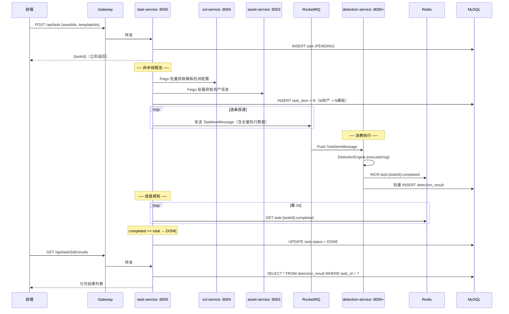

# Task-Service 架构设计 v3.1

> 任务调度核心服务。接收检测任务 → 异步拆分 → 投递 RocketMQ → 轮询进度。
> 端口：`:8005`

---

## 一、整体架构



---

## 二、核心职责

| 职责 | 说明 |
|------|------|
| 接收任务 | 前端提交 `{assetIds, templateIds}` → 创建 task 记录 |
| 数据组装 | Feign 拉取 vul-service 模板检测配置 + asset-service 资产信息 |
| 拆分投递 | M×N 组合 → task_item 持久化 → RocketMQ 逐条投递 |
| 进度感知 | 轮询 Redis 计数器 → task.status = DONE |
| 结果查询 | 前端请求时查 detection_result 表 |

---

## 三、模块结构

```
task-service/
├── task-common/                    # 公共层
│   ├── enums/
│   │   ├── TaskStatusEnum.java     # 任务状态枚举
│   │   └── TaskItemStatusEnum.java # 检测项状态枚举
│   └── pojo/
│       ├── entity/
│       │   ├── Task.java           # 任务实体
│       │   └── TaskItem.java       # 检测项实体
│       ├── dto/
│       │   ├── AssetBrief.java     # 资产精简信息
│       │   ├── VulTemplateBrief.java # 模板精简信息
│       │   └── TemplateDetectConfig.java # 模板检测配置
│       └── vo/
│           ├── TaskVO.java         # 任务 VO
│           ├── PageTaskVO.java     # 分页任务 VO
│           └── TaskResultVO.java   # 检测结果 VO
│
├── task-business/                  # 业务层
│   ├── cache/
│   │   └── TemplateCache.java      # 模板缓存（Caffeine L1 + Redis L2）
│   ├── feign/
│   │   ├── AssetServiceFeign.java  # 资产服务 Feign
│   │   └── VulServiceFeign.java    # 漏洞服务 Feign
│   ├── mapper/
│   │   ├── TaskMapper.java
│   │   ├── TaskItemMapper.java
│   │   └── DetectionResultMapper.java
│   ├── mapstruct/
│   │   ├── TaskMapstruct.java      # 任务对象映射
│   │   └── TaskItemMapstruct.java  # 检测项对象映射
│   ├── mq/
│   │   └── TaskProducerService.java # RocketMQ 生产者
│   └── service/
│       ├── TaskService.java
│       └── impl/
│           └── TaskServiceImpl.java
│
├── task-api/                       # 接口层
│   └── controller/
│       └── TaskController.java
│
└── task-bootstrap/                 # 启动层
    ├── scheduler/
    │   └── TaskProgressScheduler.java # 进度轮询调度器
    └── resources/
        └── application.yml
```

---

## 四、数据模型

### 4.1 任务表 `task`

```sql
CREATE TABLE IF NOT EXISTS `task`
(
    `task_id`         BIGINT UNSIGNED AUTO_INCREMENT COMMENT '主键',
    `task_name`       VARCHAR(200)     NOT NULL COMMENT '任务名称',
    `target_ids`      VARCHAR(2000)    NOT NULL COMMENT '资产 ID 列表（JSON 数组）',
    `vul_ids`         VARCHAR(2000)    NOT NULL COMMENT '模板 ID 列表（JSON 数组）',
    `status`          TINYINT UNSIGNED NOT NULL DEFAULT 0 COMMENT '状态: 0=待执行,1=执行中,2=已完成,3=已取消,4=异常终止',
    `total_items`     INT UNSIGNED     NOT NULL DEFAULT 0 COMMENT '检测项总数（拆分后回填）',
    `completed_items` INT UNSIGNED     NOT NULL DEFAULT 0 COMMENT '已完成数（轮询 Redis 回填）',
    `failed_items`    INT UNSIGNED     NOT NULL DEFAULT 0 COMMENT '失败数',
    `priority`        TINYINT UNSIGNED NOT NULL DEFAULT 1 COMMENT '优先级: 0=高,1=中,2=低',
    `start_time`      DATETIME COMMENT '拆分开始时间',
    `end_time`        DATETIME COMMENT '最后 item 完成时间',
    `result_summary`  JSON COMMENT '结果摘要 {"matched":3,"notMatched":46,"error":1}',
    `tenant_id`       BIGINT UNSIGNED  NOT NULL DEFAULT 0 COMMENT '租户ID, 0=平台通用',
    `create_time`     DATETIME         NOT NULL DEFAULT CURRENT_TIMESTAMP COMMENT '创建时间',
    `update_time`     DATETIME         NOT NULL DEFAULT CURRENT_TIMESTAMP ON UPDATE CURRENT_TIMESTAMP COMMENT '更新时间',
    `create_by`       VARCHAR(64)      NOT NULL DEFAULT '' COMMENT '创建人用户名',
    `update_by`       VARCHAR(64)      NOT NULL DEFAULT '' COMMENT '更新人用户名',
    `deleted_at`      BIGINT UNSIGNED  NOT NULL DEFAULT 0 COMMENT '删除时间戳(毫秒), 0=未删除',
    PRIMARY KEY (`task_id`),
    KEY `idx_tenant_status` (`tenant_id`, `status`),
    KEY `idx_tenant_deleted` (`tenant_id`, `deleted_at`)
) ENGINE = InnoDB DEFAULT CHARSET = utf8mb4 COLLATE = utf8mb4_general_ci COMMENT ='检测任务表';
```

### 4.2 检测项表 `task_item`

```sql
CREATE TABLE IF NOT EXISTS `task_item`
(
    `item_id`    BIGINT UNSIGNED AUTO_INCREMENT COMMENT '主键',
    `task_id`    BIGINT UNSIGNED  NOT NULL COMMENT '所属任务 ID',
    `asset_id`   BIGINT UNSIGNED  NOT NULL COMMENT '资产 ID',
    `vul_id`     BIGINT UNSIGNED  NOT NULL COMMENT '模板 ID',
    `status`     TINYINT UNSIGNED NOT NULL DEFAULT 0 COMMENT '状态: 0=待执行,1=匹配,2=未匹配,3=失败',
    `result`     JSON COMMENT '检测结果 JSON',
    `tenant_id`  BIGINT UNSIGNED  NOT NULL DEFAULT 0 COMMENT '租户ID, 0=平台通用',
    `create_time` DATETIME        NOT NULL DEFAULT CURRENT_TIMESTAMP COMMENT '创建时间',
    `update_time` DATETIME        NOT NULL DEFAULT CURRENT_TIMESTAMP ON UPDATE CURRENT_TIMESTAMP COMMENT '更新时间',
    `create_by`  VARCHAR(64)      NOT NULL DEFAULT '' COMMENT '创建人用户名',
    `update_by`  VARCHAR(64)      NOT NULL DEFAULT '' COMMENT '更新人用户名',
    `deleted_at` BIGINT UNSIGNED  NOT NULL DEFAULT 0 COMMENT '删除时间戳(毫秒), 0=未删除',
    PRIMARY KEY (`item_id`),
    UNIQUE KEY `uk_task_asset_vul` (`task_id`, `asset_id`, `vul_id`),
    KEY `idx_task_id` (`task_id`),
    KEY `idx_asset_id` (`asset_id`),
    KEY `idx_vul_id` (`vul_id`),
    KEY `idx_task_status` (`task_id`, `status`),
    KEY `idx_tenant_deleted` (`tenant_id`, `deleted_at`)
) ENGINE = InnoDB DEFAULT CHARSET = utf8mb4 COLLATE = utf8mb4_general_ci COMMENT ='检测项表';
```

### 4.3 状态枚举

#### TaskStatusEnum

| 值 | 名称 | 说明 |
|---|------|------|
| 0 | PENDING | 待执行 |
| 1 | RUNNING | 执行中（拆分开始） |
| 2 | DONE | 已完成 |
| 3 | CANCELLED | 已取消 |
| 4 | ERROR | 异常终止 |

> **重要**：枚举值必须与 DDL 注释一致，不得随意增减。

#### TaskItemStatusEnum

| 值 | 名称 | 说明 |
|---|------|------|
| 0 | PENDING | 待执行 |
| 1 | MATCHED | 匹配（命中漏洞） |
| 2 | NOT_MATCHED | 未匹配 |
| 3 | FAILED | 执行失败 |

---

## 五、API 设计

Base path: `/api/task`

### 5.1 创建任务

```
POST /api/task

Request:
{
    "taskName": "生产环境 CVE 扫描",
    "assetIds": [1, 2, 3],
    "templateIds": [45, 46, 47],
    "priority": 1
}

Response: ApiResponse<TaskVO.Response>
{
    "data": {
        "taskId": 1001,
        "taskName": "生产环境 CVE 扫描",
        "status": "待执行",
        "totalItems": 0,
        "completedItems": 0,
        "failedItems": 0,
        "priority": 1
    }
}
```

### 5.2 任务详情

```
GET /api/task/{taskId}

Response: ApiResponse<TaskVO.Response>
{
    "data": {
        "taskId": 1001,
        "taskName": "生产环境 CVE 扫描",
        "status": "执行中",
        "totalItems": 9,
        "completedItems": 7,
        "failedItems": 0,
        "priority": 1,
        "startTime": "2026-05-04T10:00:00",
        "endTime": null,
        "resultSummary": null
    }
}
```

### 5.3 任务列表

```
GET /api/task?page=1&pageSize=10&taskName=扫描&status=1

Response: ApiResponse<ListResult<PageTaskVO.Response>>
{
    "data": {
        "total": 50,
        "records": [...]
    }
}
```

### 5.4 取消任务

```
DELETE /api/task/{taskId}

Response: ApiResponse<Void>
```

仅 PENDING 状态可取消，否则返回错误码 2001。

### 5.5 检测结果查询

```
GET /api/task/{taskId}/results?page=1&size=20&status=matched

Response: ApiResponse<ListResult<TaskResultVO>>
{
    "data": {
        "total": 9,
        "records": [
            {
                "resultId": 1,
                "taskId": 1001,
                "taskItemId": 5,
                "templateId": 45,
                "assetId": 1,
                "status": "matched",
                "responseStatusCode": 200,
                "responseSummary": "...",
                "durationMs": 342,
                "matchedAt": "2026-05-04T10:05:00"
            }
        ]
    }
}
```

---

## 六、预检机制

### 6.1 设计目标

在任务拆分阶段，对每个检测项（资产 × 模板组合）进行预检，提前剔除无效的检测项，避免无效的消息投递和检测执行。

### 6.2 预检接口

```java
/**
 * 检测项预检器。
 * <p>
 * 在任务拆分阶段，对每个（资产 × 模板）组合进行预检，
 * 判断该组合是否有效、是否值得执行检测。
 * <p>
 * 当前实现：全返回 true（预留接口，后续可扩展具体检测逻辑）
 */
@Component
public class TaskItemPreChecker {
    
    /**
     * 预检单个检测项。
     *
     * @param asset    资产信息
     * @param template 模板配置
     * @return true=有效，false=无效（将跳过该检测项）
     */
    public boolean preCheck(AssetBrief asset, TemplateDetectConfig template) {
        // TODO: 实现具体的预检逻辑
        // 可能的检查项：
        // 1. 资产协议与模板要求是否匹配
        // 2. 资产是否在黑名单中
        // 3. 模板是否已过期/禁用
        // 4. 资产与模板的历史检测结果（避免重复检测）
        return true;
    }
    
    /**
     * 批量预检。
     *
     * @param items 待检测项列表
     * @return 有效的检测项列表
     */
    public List<TaskItem> filterValidItems(List<TaskItem> items) {
        return items.stream()
                .filter(item -> preCheck(item.getAsset(), item.getTemplate()))
                .toList();
    }
}
```

### 6.3 预检流程集成

```java
@Async("taskSplitExecutor")
public void splitAndDispatch(Task task, List<Long> assetIds, List<Long> templateIds) {
    // ... 获取资产和模板 ...
    
    // 构建所有可能的检测项
    List<TaskItem> allItems = buildTaskItems(task, assetIds, templateIds, assets, templates);
    
    // 预检：剔除无效检测项
    List<TaskItem> validItems = preChecker.filterValidItems(allItems);
    
    if (validItems.isEmpty()) {
        throw new BusinessException("预检后无有效检测项");
    }
    
    // 记录被剔除的数量
    int skippedCount = allItems.size() - validItems.size();
    if (skippedCount > 0) {
        log.info("预检剔除 {} 个无效检测项", skippedCount);
    }
    
    // 批量插入有效检测项
    taskItemService.saveBatch(validItems, 1000);
    
    // ... 后续流程 ...
}
```

### 6.4 预检结果统计

```java
@Data
public class PreCheckResult {
    private int totalItems;        // 总检测项数
    private int validItems;        // 有效检测项数
    private int skippedItems;      // 跳过的检测项数
    private List<String> skipReasons; // 跳过原因列表
}
```

---

## 七、核心流程

### 7.1 任务创建流程

```java
@Transactional
public TaskVO.Response create(TaskVO.Request request) {
    // 1. 参数校验
    validateRequest(request);
    
    // 2. 持久化任务
    Task task = taskMapstruct.toEntity(request);
    task.setStatus(TaskStatusEnum.PENDING);
    task.setTotalItems(0);
    save(task);
    
    // 3. 异步拆分（新线程，独立事务）
    taskSplitService.splitAndDispatch(task, request.getAssetIds(), request.getTemplateIds());
    
    // 4. 立刻返回
    return taskMapstruct.toResponseVO(task);
}
```

### 7.2 异步拆分流程

```java
@Async("taskSplitExecutor")
public void splitAndDispatch(Task task, List<Long> assetIds, List<Long> templateIds) {
    try {
        // 1. 更新状态为执行中
        task.setStatus(TaskStatusEnum.RUNNING);
        task.setStartTime(LocalDateTime.now());
        updateById(task);
        
        // 2. 批量获取模板配置（带缓存）
        Map<Long, TemplateDetectConfig> templates = templateCache.batchGet(templateIds);
        if (templates.isEmpty()) {
            throw new BusinessException("无有效模板");
        }
        
        // 3. 批量获取资产信息
        Map<Long, AssetBrief> assets = fetchAssetsBatch(assetIds);
        if (assets.isEmpty()) {
            throw new BusinessException("无有效资产");
        }
        
        // 4. 批量插入检测项（使用 saveBatch）
        List<TaskItem> items = buildTaskItems(task, assetIds, templateIds, assets, templates);
        taskItemService.saveBatch(items, 1000);
        
        // 5. 更新任务总数
        task.setTotalItems(items.size());
        updateById(task);
        
        // 6. 构建并发送消息
        List<TaskItemMessage> messages = buildMessages(task, items, assets, templates);
        taskProducerService.sendBatch(messages);
        
    } catch (Exception e) {
        log.error("任务拆分失败 taskId={}", task.getTaskId(), e);
        task.setStatus(TaskStatusEnum.ERROR);
        task.setResultSummary("{\"error\":\"" + e.getMessage() + "\"}");
        updateById(task);
    }
}
```

### 7.3 资产批量获取

```java
private Map<Long, AssetBrief> fetchAssetsBatch(List<Long> assetIds) {
    Map<Long, AssetBrief> assets = new LinkedHashMap<>();
    List<Long> failedIds = new ArrayList<>();
    
    for (Long assetId : assetIds) {
        try {
            var resp = assetServiceFeign.getAsset(assetId);
            if (resp != null && resp.getData() != null) {
                assets.put(assetId, resp.getData());
            } else {
                failedIds.add(assetId);
            }
        } catch (Exception e) {
            log.warn("拉取资产失败 assetId={}: {}", assetId, e.getMessage());
            failedIds.add(assetId);
        }
    }
    
    if (!failedIds.isEmpty()) {
        log.warn("部分资产拉取失败: {}", failedIds);
    }
    
    return assets;
}
```

---

## 八、模板缓存设计

### 8.1 两级缓存架构

```
Caffeine L1（本地，2000 条 / 30min）
    ↓ 未命中
Redis L2（共享，30min）
    ↓ 未穿透
Feign vul-service（穿透）
```

### 8.2 缓存实现

```java
@Component
public class TemplateCache {
    
    private final Cache<Long, TemplateDetectConfig> localCache = Caffeine.newBuilder()
            .maximumSize(2000)
            .expireAfterWrite(30, TimeUnit.MINUTES)
            .build();
    
    private final StringRedisTemplate redisTemplate;
    private final VulServiceFeign vulServiceFeign;
    
    public Map<Long, TemplateDetectConfig> batchGet(List<Long> templateIds) {
        Map<Long, TemplateDetectConfig> result = new HashMap<>();
        List<Long> missedIds = new ArrayList<>();
        
        // 1. 查 L1 本地缓存
        for (Long id : templateIds) {
            TemplateDetectConfig config = localCache.getIfPresent(id);
            if (config != null) {
                result.put(id, config);
            } else {
                missedIds.add(id);
            }
        }
        
        if (missedIds.isEmpty()) return result;
        
        // 2. 查 L2 Redis 缓存
        List<String> keys = missedIds.stream()
                .map(id -> "vul:template:" + id)
                .toList();
        List<String> values = redisTemplate.opsForValue().multiGet(keys);
        
        if (values != null) {
            for (int i = 0; i < missedIds.size(); i++) {
                String json = values.get(i);
                if (json != null) {
                    TemplateDetectConfig config = JSON.parseObject(json, TemplateDetectConfig.class);
                    result.put(missedIds.get(i), config);
                    localCache.put(missedIds.get(i), config);
                }
            }
        }
        
        // 3. 穿透查询 Feign
        List<Long> stillMissed = missedIds.stream()
                .filter(id -> !result.containsKey(id))
                .toList();
        
        if (!stillMissed.isEmpty()) {
            var resp = vulServiceFeign.batchGetTemplates(stillMissed);
            if (resp != null && resp.getData() != null) {
                for (var brief : resp.getData()) {
                    TemplateDetectConfig config = TemplateDetectConfig.from(brief);
                    result.put(brief.getId(), config);
                    localCache.put(brief.getId(), config);
                    redisTemplate.opsForValue().set(
                            "vul:template:" + brief.getId(),
                            JSON.toJSONString(config),
                            30, TimeUnit.MINUTES
                    );
                }
            }
        }
        
        return result;
    }
}
```

---

## 九、RocketMQ 生产者

### 9.1 消息体设计

```java
@Data
public class TaskItemMessage implements Serializable {
    // 任务标识
    private Long taskId;
    private Long itemId;
    private Long tenantId;
    private Long createdAt;
    
    // 资产信息（VariableContext 用）
    private String assetProtocol;
    private String assetHost;
    private Integer assetPort;
    private String assetPath;
    
    // 模板检测配置
    private String templateId;       // YAML 业务 ID
    private Long templateDbId;       // DB 主键
    private String flow;             // 执行流
    private Map<String, Object> variables;
    private List<HttpStep> httpSteps;
}
```

### 9.2 批量发送

```java
@Component
public class TaskProducerService {
    
    private final RocketMQTemplate rocketMQTemplate;
    
    private static final String TOPIC = "task_item_topic";
    private static final int SEND_TIMEOUT = 3000;
    
    public void sendBatch(List<TaskItemMessage> messages) {
        for (TaskItemMessage msg : messages) {
            rocketMQTemplate.asyncSend(TOPIC, msg, new SendCallback() {
                @Override
                public void onSuccess(SendResult sendResult) {
                    log.debug("消息发送成功: taskId={}, itemId={}", msg.getTaskId(), msg.getItemId());
                }
                
                @Override
                public void onException(Throwable e) {
                    log.error("消息发送失败: taskId={}, itemId={}", msg.getTaskId(), msg.getItemId(), e);
                    markItemFailed(msg.getItemId());
                }
            }, SEND_TIMEOUT);
        }
    }
    
    private void markItemFailed(Long itemId) {
        // 标记检测项为失败状态
        taskItemService.updateStatus(itemId, TaskItemStatusEnum.FAILED);
    }
}
```

---

## 十、进度轮询调度器

### 10.1 实现

```java
@Component
public class TaskProgressScheduler {
    
    private final TaskService taskService;
    private final RedisTemplate<String, String> redisTemplate;
    
    private final ConcurrentHashMap<Long, Integer> lastCompletedMap = new ConcurrentHashMap<>();
    
    @Scheduled(fixedDelayString = "${task.progress.poll-interval-ms:2000}")
    public void pollProgress() {
        List<Long> runningIds = taskService.listRunningTaskIds();
        
        for (Long taskId : runningIds) {
            try {
                String key = "task:" + taskId + ":completed";
                String value = redisTemplate.opsForValue().get(key);
                if (value == null) continue;
                
                int completed = Integer.parseInt(value);
                Integer last = lastCompletedMap.put(taskId, completed);
                
                // 只在有变化时才更新 DB
                if (last != null && last == completed) continue;
                
                Task task = taskService.getById(taskId);
                if (task == null) {
                    lastCompletedMap.remove(taskId);
                    continue;
                }
                
                task.setCompletedItems(completed);
                taskService.updateById(task);
                
                // 判断任务完成
                if (task.getTotalItems() != null && completed >= task.getTotalItems()) {
                    task.setStatus(TaskStatusEnum.DONE);
                    task.setEndTime(LocalDateTime.now());
                    taskService.updateById(task);
                    lastCompletedMap.remove(taskId);
                    
                    log.info("任务完成: taskId={}, completed={}/{}", 
                            taskId, completed, task.getTotalItems());
                }
            } catch (Exception e) {
                log.error("轮询任务进度异常: taskId={}", taskId, e);
            }
        }
    }
}
```

### 10.2 Redis 键设计

| Key | 操作 | 写入方 | 读取方 | 生命周期 |
|-----|------|--------|--------|---------|
| `task:{taskId}:completed` | INCR | detection | task（每 2s 轮询） | 任务完成后 24h |
| `task:{taskId}:failed` | INCR | detection | — | 24h |
| `vul:template:{id}` | SET/GET | task（穿透时 SET） | task | 30min |

---

## 十一、异常处理策略

### 11.1 拆分阶段异常

| 异常场景 | 处理策略 |
|---------|---------|
| vul-service 不可达 | 任务状态 → ERROR，记录异常日志 |
| asset-service 不可达 | 任务状态 → ERROR，记录异常日志 |
| 所有资产均无效 | 任务状态 → ERROR，result_summary = "无有效资产" |
| 所有模板均无效 | 任务状态 → ERROR，result_summary = "无可用模板" |
| 部分资产/模板无效 | 跳过无效项，正常拆分有效组合，日志记录跳过的 |
| 批量 INSERT 失败 | 事务回滚，任务状态 → ERROR |
| MQ 发送失败（重试 3 次后） | 单条 item → FAILED，写 DB + 记录日志 |

### 11.2 轮询阶段异常

| 异常场景 | 处理策略 |
|---------|---------|
| Redis 主键不存在 | 跳过该任务（可能已完成并被清理） |
| completed 值异常（> totalItems） | 修正为 totalItems，标记 DONE |

---

## 十二、配置说明

### 12.1 application.yml

```yaml
server:
  port: 8005

spring:
  application:
    name: task-service
  
  datasource:
    url: jdbc:mysql://localhost:3306/hawkeye
    username: ${DB_USERNAME:root}
    password: ${DB_PASSWORD:123456}
  
  data:
    redis:
      host: ${REDIS_HOST:localhost}
      port: ${REDIS_PORT:6379}
      password: ${REDIS_PASSWORD:}

rocketmq:
  name-server: ${ROCKETMQ_HOST:localhost}:${ROCKETMQ_PORT:9876}
  producer:
    group: task_item_producer_group
    send-message-timeout: 3000
    retry-times-when-send-failed: 3

task:
  progress:
    poll-interval-ms: 2000

# 异步线程池配置
task-split:
  executor:
    core-pool-size: 4
    max-pool-size: 8
    queue-capacity: 100
    thread-name-prefix: task-split-
```

---

## 十三、待优化项

| 序号 | 问题 | 当前状态 | 优化方案 |
|------|------|---------|---------|
| 1 | 逐条 INSERT task_item | 已实现 | 改为 saveBatch 批量插入 |
| 2 | 消息逐条发送 | 已实现 | 考虑批量发送优化 |
| 3 | 缺少分布式锁 | 未实现 | 引入 Redisson 分布式锁 |
| 4 | 资产拉取失败静默跳过 | 已实现 | 记录失败资产 ID 到 result_summary |
| 5 | TemplateDetectConfig 手工映射 | 已实现 | 改用 MapStruct |
