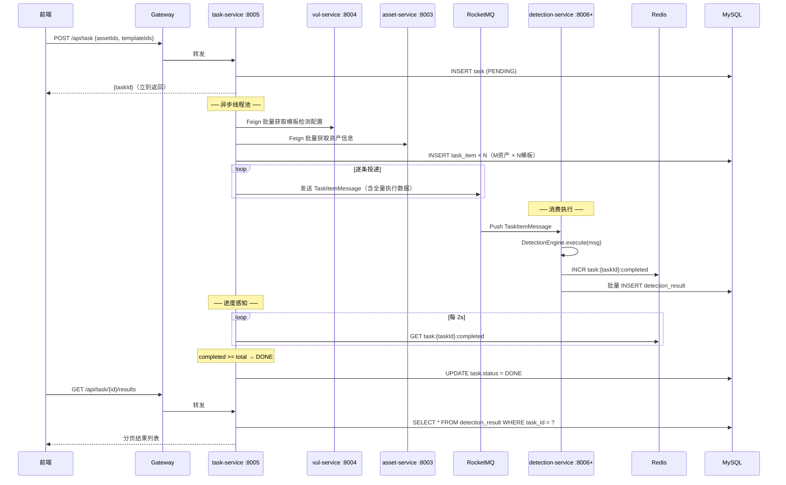

# 任务调度服务 — 架构设计

> task-service :8005 — 调度核心，负责拆分、投递、进度感知。
> detection-service :8006+ — 纯 Worker，消费消息 → 执行 → 写结果。

---

## 一、整体交互



## 二、核心职责

| 职责 | 说明 |
|------|------|
| 接收任务 | 前端提交 `{assetIds, templateIds}` → 创建 task 记录 |
| 数据组装 | Feign 拉取 vul-service 模板检测配置 + asset-service 资产信息 |
| 拆分投递 | M×N 组合 → task_item 持久化 → RocketMQ 逐条投递 |
| 进度感知 | 轮询 Redis 计数器 → task.status = DONE |
| 结果查询 | 前端请求时查 detection_result 表 |

## 三、消息体设计

```java
TaskItemMessage {
    // 任务标识
    Long taskId;
    Long itemId;
    Long tenantId;
    Long createdAt;

    // 资产信息（VariableResolver 用）
    String assetProtocol;    // http / https
    String assetHost;        // example.com
    Integer assetPort;       // 443
    String assetPath;        // /api

    // 模板检测配置
    String templateId;       // YAML 业务 ID
    String flow;             // 执行流
    Map<String, Object> variables;  // 模板变量
    List<HttpStep> httpSteps;      // 含 matchers + extractors
}
```

**消息体大小**：单模板平均 ~1.5KB JSON，5000 条 ≈ 7.5MB，对 RocketMQ 完全可接受。

detection-service 拿到消息直接执行，不调任何 Feign。

## 四、模板缓存

task-service 调用 vul-service 获取模板检测配置时，加两级缓存：

```
Caffeine L1（本地，2000 条 / 30min）
    ↓ 未命中
Redis L2（共享，30min）
    ↓ 未命中
Feign vul-service（穿透）
```

| Key | TTL | 容量 |
|-----|-----|------|
| `vul:template:{id}` | 30 min | L1: 2000, L2: 无限制 |

命中率：一次任务 5000 条消息，模板种类数通常 ≤ 50，缓存命中率 > 99%。

## 五、API

Base path: `/api/task`

### `POST /api/task` — 创建任务

```
Body:
  {
    "name": "生产环境 CVE 扫描",
    "assetIds": [1, 2, 3],
    "templateIds": [45, 46, 47]
  }

Response: { "taskId": 1001 }
```

### `GET /api/task/{id}` — 任务状态

```
Response:
  {
    "taskId": 1001,
    "name": "生产环境 CVE 扫描",
    "status": "RUNNING",      // PENDING / RUNNING / DONE / FAILED
    "totalItems": 9,
    "completedItems": 7,
    "failedItems": 0,
    "createTime": "..."
  }
```

### `GET /api/task/{id}/results` — 检测结果（分页）

```
Query: page, size, status(matched/not_matched/error)

Response:
  {
    "total": 9,
    "records": [
      {
        "id": 1,
        "assetId": 1,
        "assetHost": "example.com",
        "templateId": 45,
        "templateName": "CVE-2024-0012",
        "status": "matched",
        "durationMs": 342,
        "matchedAt": "..."
      }
    ]
  }
```

### `GET /api/task` — 任务列表

```
Query: page, size, status

Response: 分页任务列表
```

## 六、Redis 键设计

| Key | 操作 | 写入方 | 读取方 | 生命周期 |
|-----|------|--------|--------|---------|
| `task:{taskId}:completed` | INCR | detection | task（每 2s 轮询） | 任务完成后 24h |
| `task:{taskId}:failed` | INCR | detection | — | 24h |
| `task:{taskId}:startTime` | SET | task | — | 24h |
| `vul:template:{id}` | SET/GET/DEL | task（穿透时 SET） | task | 30min |
| `worker:load:{workerId}` | SET | detection（每 5s） | task（分发时查） | 15s |

## 七、RocketMQ 配置

| 参数 | 值 |
|------|-----|
| Topic | `task_item_topic` |
| ConsumerGroup | `task_item_consumer_group` |
| 消费模式 | CLUSTERING |
| Queue 数量 | 32 |
| 最大重试 | 16 次 |
| 死信 | `%DLQ%task_item_consumer_group` |

## 八、RocketMQ 消息分发策略

```
task-service Producer
  │
  ├─ 查 Redis worker:load:* 获取所有 Worker 负载
  ├─ 选 activeThreads 最少的 Worker
  ├─ MessageQueueSelector 定向投递到该 Worker 对应 Queue
  └─ 无负载数据时 → 轮询
```

每个 detection Worker 每 5 秒上报：
```
Key: worker:load:{workerId}
Value: {
    "workerId": "worker-192.168.1.10",
    "activeThreads": 12,
    "maxThreads": 64,
    "lastReportTime": 1716875300000
}
TTL: 15 秒（过期 = Worker 失联）
```

## 九、detection-service 降级路径

正常路径：消息体携带全量数据，detection 零外部依赖。

如果消息体异常（如反序列化失败），记录 ERROR 结果，不重试。数据问题重试无意义——应由 task-service 在拆分阶段验证。

不设计 Feign 降级路径——消息体携带全量数据的设计已经消除了 detection 对外部服务的依赖。

## 十、实施优先级

| 阶段 | 内容 |
|------|------|
| P0 | 创建 task-service 模块骨架（maven + 包结构 + application.yml） |
| P0 | task 表 + task_item 表 DDL |
| P0 | 接收任务 API（`POST /api/task`）— 入库 + 异步拆分 |
| P0 | 模板缓存（Caffeine + Redis）— 调用 vul-service Feign |
| P0 | 拆分逻辑（M×N → task_item） |
| P0 | RocketMQ Producer + MessageQueueSelector |
| P1 | 进度轮询（Redis `task:{taskId}:completed` → DONE） |
| P1 | 结果查询 API（`GET /api/task/{id}/results`） |
| P2 | Worker 负载感知投递 |
