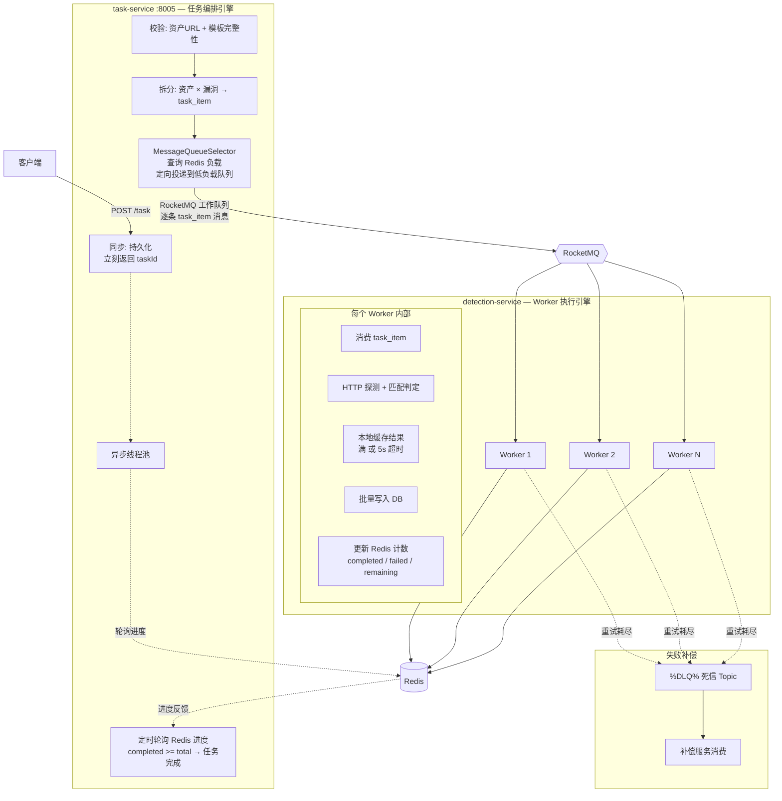

# 任务调度系统架构设计

## 概述

任务调度系统是 Hawkeye Cloud 的**核心检测引擎**，负责将用户提交的漏洞检测任务分解、分发到多个工作节点并行执行。基于 **RocketMQ 工作队列 + Redis 进度感知** 实现异步解耦和可靠投递。

> **对应微服务**：本架构由三个核心服务协作——**`task-service`**（任务编排引擎）、**`detection-service`**（Worker 执行引擎、多实例）、死信由 RocketMQ 原生死信机制处理。漏洞模板由 **`vul-service`** 管理，资产数据由 **`asset-service`** 提供。

---

## 整体架构



**关键设计原则**：
- 没有独立的"预处理队列"——校验、拆分、分发是 **task-service 内部线程池**完成的，不经过第二跳消息
- task-service 直接发消息到 **RocketMQ 工作队列**，中间无中转
- 负载感知的 `MessageQueueSelector` 在 **task-service 发消息时调用**，不是独立服务
- **Redis 双向用途**：Worker 上报实时负载 + detection 更新任务进度计数
- task-service 通过**定时轮询 Redis** 感知任务完成，不引入回调 Topic

---

## 1. task-service — 任务编排引擎

### 同步阶段（立刻响应）

| 步骤 | 说明 |
|------|------|
| 接收请求 | `POST /task`，入参：资产列表 + 漏洞模板列表 |
| 持久化 | 写入 `task` 表（status=PENDING, total_items=N）|
| 返回 | 立刻返回 `taskId`，不等待执行 |

### 异步阶段（线程池）

```
线程池启动 → 校验 → 拆分 → 分发 → 轮询 Redis → 标记完成
```

| 步骤 | 说明 |
|------|------|
| 校验 | 逐条检查资产 URL 格式、漏洞模板完整性、关联关系存在性 |
| 拆分 | 资产 × 漏洞 笛卡尔积展开，生成 N 条 `task_item` 记录 |
| 分发 | 查询 Redis 获取各 Worker 负载，`MessageQueueSelector` 定向投递 |
| 轮询 | 定时（如 2s）查询 Redis 中 `task:{taskId}:completed` |
| 完成 | `completed >= total` 时更新 `task.status=DONE` |

### 业务场景示例

假设某用户提交了一个包含 **500 个资产 × 10 个漏洞模板 = 5000 个检测组合** 的任务：

1. **同步响应** → task-service 持久化，返回 `taskId`（约 50ms）
2. **异步校验** → 线程池逐条校验 500 个资产 URL + 10 个模板完整性（约 3s）
3. **拆分为 5000 条 task_item** → 写入 DB，更新 `task.total_items = 5000`
4. **负载感知分发** → 查 Redis 中 8 个 Worker 的负载，`MessageQueueSelector` 按权重分配
5. **定向投递** → 逐条发 RocketMQ 工作队列消息（含 `taskId + itemId`）
6. **进度监控** → 定时轮询 Redis，5000 条全部完成后标记 `task.status=DONE`

---

## 2. detection-service — Worker 执行引擎

### 核心职责

| 职责 | 说明 |
|------|------|
| 并发探测 | 消费 task_item 消息，提交到虚拟线程池并发 HTTP 请求 |
| 匹配判定 | 根据漏洞模板的 matchers 规则判定响应是否命中 |
| 批量写库 | 结果先写入本地缓存（List），满 500 条或 5s 超时后批量 INSERT |
| 计数上报 | 每条结果完成后立即 `INCR task:{taskId}:completed` / `failed` |
| 负载上报 | 5s 间隔向 Redis 上报当前队列深度 + 活跃线程数 |
| 重试 | HTTP 超时等瞬时失败利用 RocketMQ 重试，耗尽后转入死信 |

### 批量写入策略

```java
// 本地缓存，避免逐条 INSERT 冲击 DB
List<DetectionResult> buffer = new ArrayList<>();

void onResult(DetectionResult r) {
    buffer.add(r);
    redis.incr("task:" + r.getTaskId() + ":" + (r.isSuccess() ? "completed" : "failed"));
    if (buffer.size() >= 500) flush();
}

@Scheduled(fixedDelay = 5000)
void flushIfTimeout() { if (!buffer.isEmpty()) flush(); }

void flush() {
    detectionResultMapper.insertBatch(buffer);
    buffer.clear();
}
```

### 负载上报数据结构

```json
{
  "workerId": "worker-1",
  "queueSize": 23,
  "activeThreads": 12,
  "maxThreads": 32,
  "lastReportTime": 1716875300000
}
```

---

## 3. 死信处理

| 职责 | 说明 |
|------|------|
| 自动转入 | RocketMQ 原生死信机制，消费失败 N 次后自动进入 `%DLQ%<ConsumerGroup>` |
| 补偿消费 | 死信消费者以批量、低优先级方式处理，记录详细异常上下文 |
| 故障隔离 | 异常消息与正常消息物理隔离（独立 Topic），避免冲击核心链路 |
| 原因诊断 | 记录请求参数、响应内容、错误堆栈，支持按异常类型/时间统计分析 |

---

## 4. 技术选型

| 组件 | 技术 | 用途 |
|------|------|------|
| 消息队列 | Apache RocketMQ 5.3.3 | 工作队列（task_item 消息）、原生死信 |
| 进度存储 | Redis | Worker 负载信息 + 任务进度计数（INCR） |
| 分布式锁 | Redisson | 保障拆分/分发阶段的原子性 |
| 并发 | Java 21 虚拟线程 | detection Worker 高并发 HTTP 探测 |
| 批量写 | 本地缓存 + 定时 flush | 减少 DB 写入次数 |

---

## 5. 实施路线

| 阶段 | 内容 |
|------|------|
| 1. 基础设施 | RocketMQ 环境搭建、Topic/ConsumerGroup 配置 |
| 2. task-service | 任务接口 + 持久化 + 异步线程池（校验 → 拆分 → 分发） |
| 3. detection-service | Worker 消费 + HTTP 探测 + 匹配判定 + 批量写库 + Redis 计数 |
| 4. 负载感知 | Worker 5s 上报负载 → Redis → MessageQueueSelector 查询 |
| 5. 进度感知 | task-service 定时轮询 Redis → completed >= total → 标记完成 |
| 6. 死信 | RocketMQ 原生死信配置 + 补偿消费者 |
