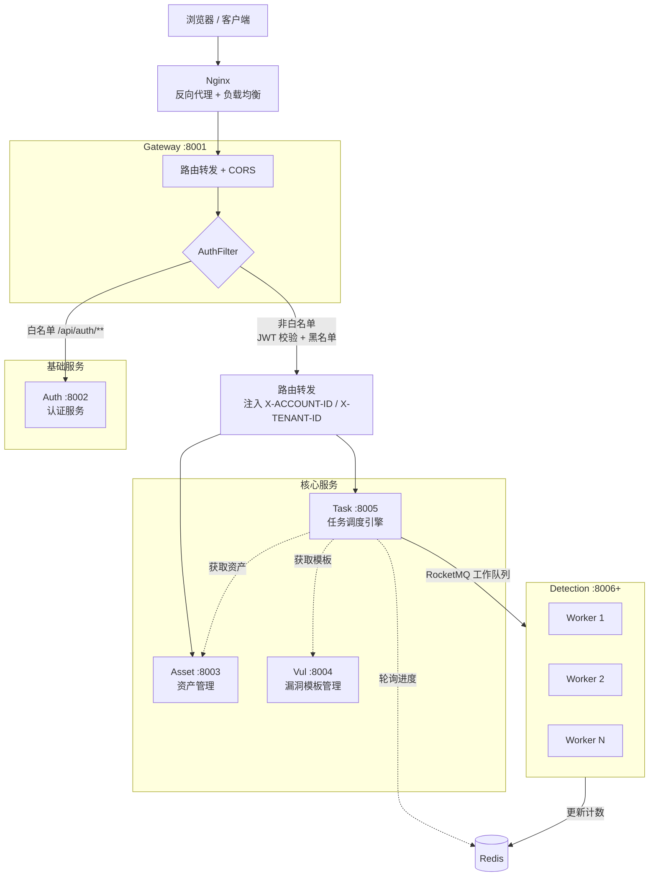
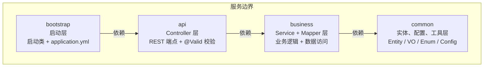
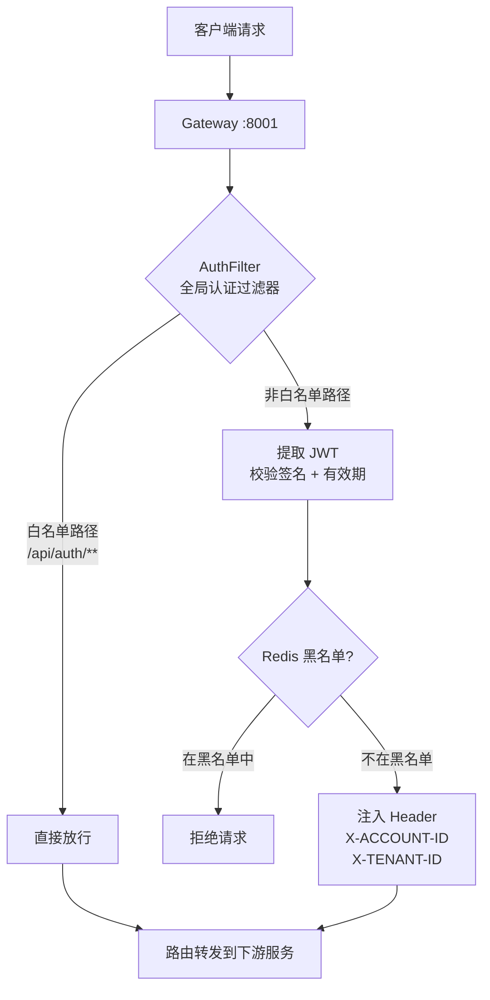
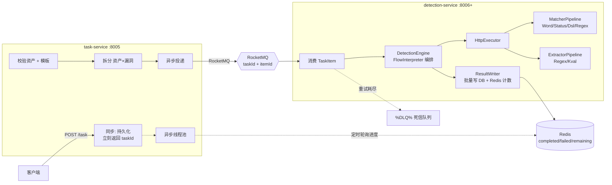

# Hawkeye Cloud — 架构设计

## 整体架构

### 服务职责矩阵

| 服务 | 端口 | 类别 | 职责 | 依赖 |
|------|------|------|------|------|
| gateway-service | 8001 | 基础 | 统一入口、JWT 鉴权、路由转发 + CORS | Nacos |
| auth-service | 8002 | 基础 | 用户认证、Token 签发 | MySQL、Redis |
| asset-service | 8003 | 核心 | 资产 CRUD、分类管理 | MySQL |
| vul-service | 8004 | 核心 | 漏洞模板 CRUD、分类、标签、YAML 导入 | MySQL |
| task-service | 8005 | 核心 | 任务提交、拆分、分发（调度核心） | MySQL、RocketMQ、Redis |
| detection-service | 8006+ | 核心 | 检测 Worker（HTTP 探测 + 匹配引擎），可水平扩展 | RocketMQ、Redis |

---

## 分层架构（每个微服务内部）

这种分层的优势：
- **依赖单向**：bootstrap → api → business → common，无循环依赖
- **职责清晰**：启动、接口暴露、业务实现、公共基础设施各司其职
- **便于测试**：business 层的 Service 可独立单元测试

---

## 网关设计

网关使用 Spring Cloud Gateway，配置路由规则、CORS 和全局 JWT 认证过滤器：

### 认证链路

---

## 多租户设计

基于 MyBatis-Plus 的 `TenantLineHandler` 实现：

1. 请求通过 `RequestContextFilter` 拦截，从 Header 提取 `X-TENANT-ID`
2. 存入 `RequestContext`（ThreadLocal）
3. `MultiTenantInterceptor`（TenantLineHandler）在 SQL 执行时自动拼接 `AND tenant_id = ?`
4. `RequestContext` 在请求结束后由 Filter 清理，防止内存泄漏

---

## 认证设计（JWT）

| 组件 | 说明 |
|------|------|
| 令牌格式 | JWT，包含 `accountId`、`tenantId`、`username`、过期时间 |
| 存储 | Redis（用于黑名单 / Token 主动失效） |
| 密码编码 | BCryptPasswordEncoder |

---

## 检测链路（核心）

核心检测流程由四个核心服务协作完成：

1. **用户提交任务** → `task-service` 同步持久化，立刻返回 `taskId`
2. **异步校验拆分** → 内部线程池校验资产 URL + 漏洞模板完整性，拆分为 `资产 × 漏洞` 检测项
3. **异步投递** → 逐条异步发送到 RocketMQ，由消费端集群竞争消费
4. **Worker 并发执行** → `detection-service` 消费消息，VariableContext 解析变量 → HttpExecutor 探测 → MatcherPipeline 匹配 → ExtractorPipeline 提取 → FlowInterpreter 执行流编排
5. **结果写入** → ResultWriter 本地缓冲后批量写 DB + Redis INCR 计数
6. **进度感知** → `task-service` 定时轮询 Redis 检查 `completed >= total`，判定任务完成
7. **失败处理** → 重试耗尽后自动进入 RocketMQ 原生死信队列

---

## 规划中服务

| 服务 | 说明 | 优先级 |
|------|------|--------|
| tenant-service | 多租户管理（SaaS 隔离）：租户 CRUD、配额管理 | P1 |
| audit-service | 日志审计服务：操作记录、安全审计、合规 | P2 |

当前多租户通过 MyBatis-Plus `TenantLineHandler` 在 SQL 层面实现，租户 ID 由网关注入 Header。独立租户服务将提供更完整的管理能力。
