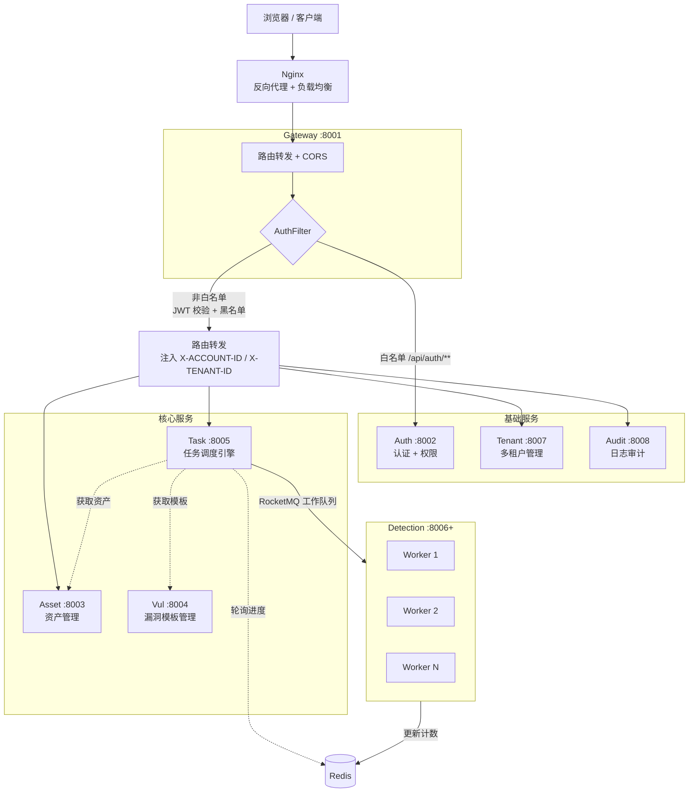
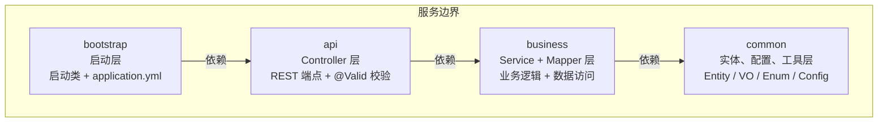
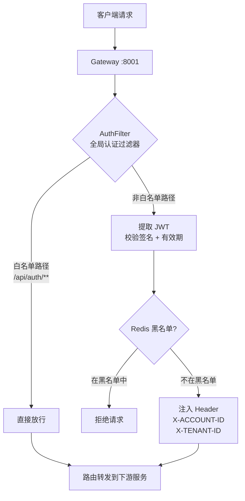
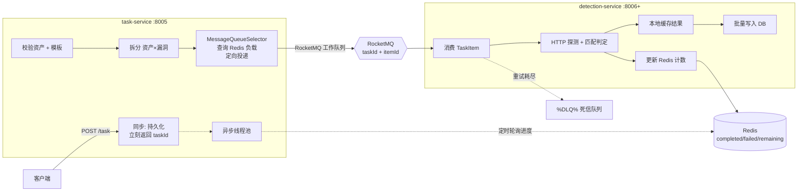

# Hawkeye Cloud — 架构设计

## 整体架构

### 服务职责矩阵

| 服务               | 端口   | 类别 | 职责                              | 依赖                    |
|------------------|------|----|---------------------------------|-----------------------|
| gateway-service  | 8001 | 基础 | 统一入口、JWT 鉴权、路由转发 + CORS        | Nacos                 |
| auth-service     | 8002 | 基础 | 用户认证、Token 签发、权限管理（RBAC）       | MySQL、Redis           |
| tenant-service   | 8007 | 基础 | 多租户 CRUD、配额管理（SaaS 隔离）         | MySQL                 |
| audit-service    | 8008 | 基础 | 操作日志记录、安全审计                    | MySQL                 |
| asset-service    | 8003 | 核心 | 资产 CRUD、分类管理                    | MySQL                 |
| vul-service      | 8004 | 核心 | 漏洞检测模板 CRUD、分类、版本管理            | MySQL                 |
| task-service     | 8005 | 核心 | 任务提交、拆分、分发（预处理队列）              | MySQL、RocketMQ、Redis  |
| detection-service | 8006+ | 核心 | 检测执行 Worker（工作队列）、可多实例部署       | RocketMQ、Redis、Feign(asset+vul) |

---

## 分层架构（每个微服务内部）

这种分层的优势：
- **依赖单向**：bootstrap → api → business → common，无循环依赖
- **职责清晰**：启动、接口暴露、业务实现、公共基础设施各司其职
- **便于测试**：business 层的 Service 可独立单元测试

---

## 网关设计

网关使用 Spring Cloud Gateway，配置了路由规则、CORS 和全局 JWT 认证过滤器：

| 路由              | 目标服务            | 路径前缀                                                  |
|-----------------|-----------------|-------------------------------------------------------|
| `/api/auth/**`  | `auth-service`  | StripPrefix=1 （即 `/api/auth/login` → `/auth/login`）   |
| `/api/asset/**` | `asset-service` | StripPrefix=1                                           |

### 认证链路

> 网关已于 **v0.2.0** 完成 JWT 鉴权过滤器的实现，包括白名单放行、JWT 校验、Redis 黑名单（主动失效/登出/踢人）、请求头注入。

---

## 多租户设计

基于 MyBatis-Plus 的 `TenantLineHandler` 实现：

1. 请求通过 `RequestContextFilter` 拦截，从 Header 提取 `X-TENANT-ID`
2. 存入 `RequestContext`（ThreadLocal）
3. `MultiTenantInterceptor`（TenantLineHandler）在 SQL 执行时自动拼接 `AND tenant_id = ?`
4. `RequestContext` 在请求结束后由 Filter 清理，防止内存泄漏

关键设计考量：
- 租户 ID 由上游（网关或认证服务）解析并注入 Header
- 使用 MyBatis-Plus 内置多租户能力，对业务代码**零侵入**
- 支持按表粒度控制是否需要多租户过滤

---

## 数据访问层

使用 **MyBatis-Plus** 替代传统 MyBatis：

- `BaseMapper<T>` 提供内置 CRUD，无需编写 XML
- 自定义复杂查询（如资产分页）通过 MyBatis XML Mapper 实现
- 枚举通过 `IEnum<T>` 接口统一处理
- 逻辑删除（`deleted` 字段）全局开启
- 分页通过 `PaginationInnerInterceptor` 自动拦截

---

## 认证设计（JWT）

| 组件   | 说明                                 |
|------|------------------------------------|
| 令牌格式 | JWT，包含 `accountId`、`tenantId`、过期时间 |
| 存储   | Redis（用于校验/续签/黑名单）                 |
| 密码编码 | BCryptPasswordEncoder              |
| 安全配置 | 当前全放行，后续添加 JWT 认证过滤器；含 RBAC 权限管理能力 |

---

## 检测链路（核心）

核心检测流程由四个核心服务协作完成：

1. **用户提交任务** → `task-service` 同步持久化，立刻返回 `taskId`
2. **异步校验拆分** → 内部线程池校验资产 URL + 漏洞模板完整性，拆分为 `资产 × 漏洞` 检测项
3. **负载感知分发** → `MessageQueueSelector` 查询 Redis 中 Worker 负载，定向投递到低负载队列
4. **Worker 并发执行** → `detection-service` 消费消息，HTTP 探测 + 匹配判定，结果本地缓存后批量写 DB，同时更新 Redis 计数
5. **进度感知** → `task-service` 定时轮询 Redis 检查 `completed >= total`，判定任务完成
6. **失败处理** → 重试耗尽后自动进入 RocketMQ 原生死信队列，补偿服务消费

## 未来规划

| 序号 | 任务              | 说明                                          |
|----|-----------------|---------------------------------------------|
| 1  | **漏洞管理服务**      | 漏洞检测模板 CRUD、分类、版本管理，检测知识库的核心                |
| 2  | **任务服务**        | 任务提交/拆分/分发，对接 RocketMQ，实现预处理队列              |
| 3  | **检测服务**        | Worker 节点实现，HTTP 探测 + 负载上报 + 死信处理            |
| 4  | **租户服务**        | 多租户 CRUD、配额管理（从 auth-service 中解耦）            |
| 5  | **日志审计服务**      | 操作日志记录、安全审计                                 |
| 6  | **认证服务增强**      | 注册、登出、Token 刷新、RBAC 权限管理                     |
| 7  | **分布式事务**       | Seata 确保跨服务数据一致性                             |
| 8  | **流量控制**        | Sentinel 限流熔断                                 |
| 9  | **测试覆盖**        | Testcontainers 集成测试 + Mockito 单元测试            |
| 10 | **CI/CD**       | Docker 容器化 + GitHub Actions                    |

### 已完成的规划项

- ~~网关鉴权过滤器~~ — AuthFilter 统一校验 JWT，注入 Tenant ID
- ~~资产服务完善~~ — 资产 CRUD + 分类管理 + 资产-分类关联，11 个端点全部就绪
