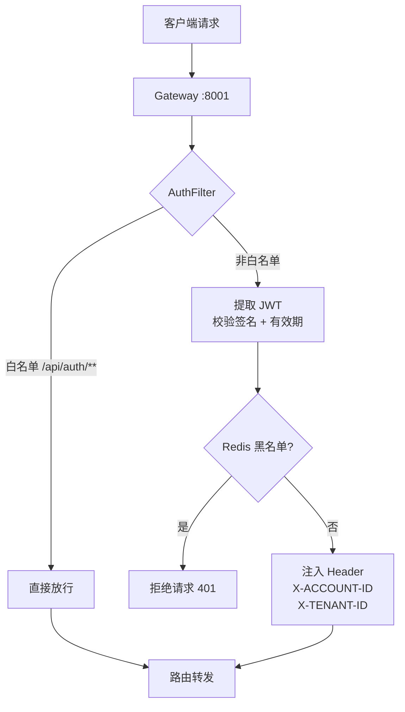

# 网关服务（gateway-service）

**端口：** `:8001`
**状态：** 基础阶段 —— 路由转发 + JWT 鉴权 + CORS

> 当前网关仅有路由转发和白名单过滤功能，尚未实现完整的 API 网关能力（限流、熔断等）。

---

## 定位

系统统一入口，负责请求路由、JWT 鉴权、跨域处理。

## 子模块结构

| 子模块 | 关键类 | 职责 |
|--------|--------|------|
| gateway-common | `JwtUtils`、`JwtToken`、`GatewayConstants` | 响应式 JWT 校验 + Redis 黑名单 |
| gateway-business | `AuthFilter` | 全局认证过滤器 |
| gateway-bootstrap | 启动类 + `application.yml` | 路由配置、CORS、服务发现、Redis |

## 认证链路

## 已配置路由

| 路由 | 目标服务 |
|------|----------|
| `/api/auth/**` | `lb://auth-service` |
| `/api/asset/**` | `lb://asset-service` |
| `/api/vul/**` | `lb://vul-service` |
| `/api/task/**` | `lb://task-service` |

## 已配置能力

- **CORS** — 全局配置，允许跨域请求
- **服务发现** — Nacos 注册中心
- **Redis** — 响应式 Redis（Lettuce），用于 JWT 黑名单
