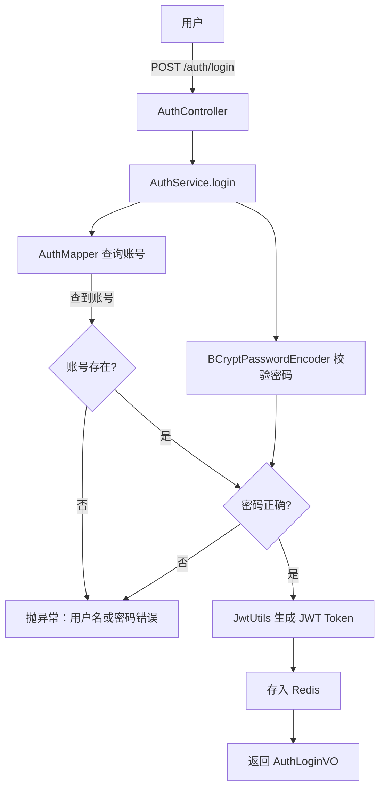

# 认证服务（auth-service）

**端口：** `:8002`
**状态：** 完成 —— 登录 + JWT 签发 + 租户管理

---

## 定位

用户认证与租户管理服务，负责登录校验、JWT Token 签发和租户 CRUD。

## 子模块结构

| 子模块 | 关键类 | 职责 |
|--------|--------|------|
| auth-common | `Account`（实体）、`AuthLoginVO`（VO）、`JwtUtils` | 实体、JWT 工具 |
| auth-api | `AuthController` | 登录接口 |
| auth-business | `AuthService`、`AuthServiceImpl`、`AuthMapper` | 认证逻辑 |
| auth-bootstrap | `AuthApplication` | 启动类 |

## API 端点

### 认证接口

| 方法 | 路径 | 说明 |
|------|------|------|
| POST | `/auth/login` | 登录，返回 token + accountId + tenantId |

### 租户管理接口

| 方法 | 路径 | 说明 |
|------|------|------|
| POST | `/auth/tenants` | 创建租户 |
| GET | `/auth/tenants` | 查询租户列表 |
| GET | `/auth/tenants/{id}` | 查询租户详情 |
| PUT | `/auth/tenants/{id}` | 更新租户 |
| DELETE | `/auth/tenants/{id}` | 删除租户 |

## 数据模型

| 表 | 说明 | 关键字段 |
|----|------|----------|
| `account` | 用户账号 | username（全局唯一）、password（BCrypt）、tenant_id |
| `tenant` | 租户 | name、contact_email、status、max_assets、max_users、max_tasks |

---

## 租户设计

### 方案选择

讨论了两种方案：
- **独立 tenant-service**：与 auth 解耦，但增加服务数和运维复杂度
- **合并到 auth-service**：用户与租户天然耦合（account.tenant_id），auth 管理租户 CRUD 是自然的延伸

最终选择合并到 auth-service——MVP 阶段租户管理是简单 CRUD，不值得独立服务。未来如需独立，迁移代价很小（Entity 迁移 + Controller 迁移 + Feign 替换）。

### 多租户隔离机制

多租户数据隔离在 SQL 层面通过 MyBatis-Plus `TenantLineHandler` 实现：
1. 网关 `AuthFilter` 从 JWT 提取 `tenantId`，注入 `X-TENANT-ID` 请求头
2. `RequestContextFilter` 将请求头存入 ThreadLocal
3. `MultiTenantInterceptor` 在 SQL 执行时自动拼接 `AND tenant_id = ?`
4. `account` 表跳过租户过滤（登录需要全局用户名查询）

### 配额字段

`max_assets`、`max_users`、`max_tasks` 为可选配额上限，`NULL` 表示无限制。MVP 阶段预设字段，后续在业务层校验。

## 认证流程

## JWT 设计

| 组件 | 说明 |
|------|------|
| 令牌格式 | JWT，包含 accountId、tenantId、username、过期时间 |
| 密码编码 | BCryptPasswordEncoder |
| 存储 | Redis（用于黑名单 / Token 主动失效） |

## 数据模型

| 表 | 说明 | 关键字段 |
|----|------|----------|
| `account` | 用户账号 | username（全局唯一）、password（BCrypt）、tenant_id |
| `tenant` | 租户 | name、contact_email、status、max_assets、max_users、max_tasks |

## 待完善

- [ ] 用户注册
- [ ] 登出 + Token 主动失效
- [ ] Token 刷新
- [ ] RBAC 权限管理
- [ ] 配额校验（资产/用户/任务上限）
