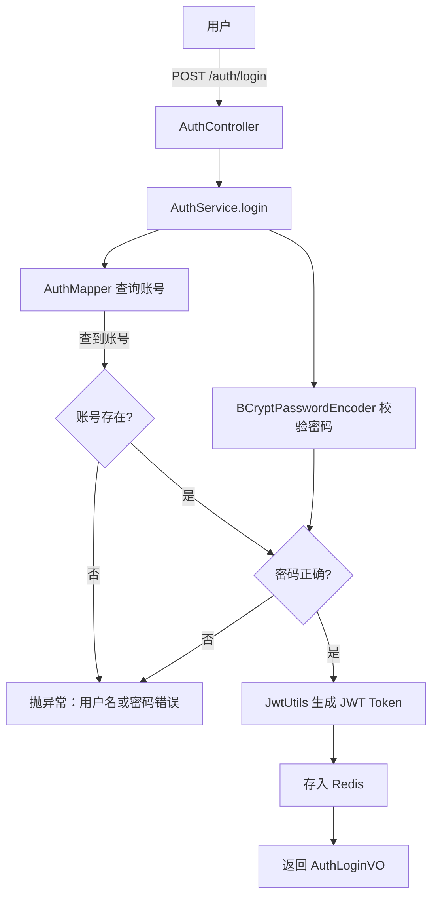

# 认证服务（auth-service）

**端口：** `:8002`
**状态：** 基础阶段 —— 登录 + JWT 签发

> 当前仅有登录认证和 JWT Token 签发功能，尚未实现注册、登出、Token 刷新、RBAC 权限管理等完整能力。

---

## 定位

用户认证服务，负责登录校验和 JWT Token 签发。

## 子模块结构

| 子模块 | 关键类 | 职责 |
|--------|--------|------|
| auth-common | `Account`（实体）、`AuthLoginVO`（VO）、`JwtUtils` | 实体、JWT 工具 |
| auth-api | `AuthController` | 登录接口 |
| auth-business | `AuthService`、`AuthServiceImpl`、`AuthMapper` | 认证逻辑 |
| auth-bootstrap | `AuthApplication` | 启动类 |

## API 端点

| 方法 | 路径 | 说明 |
|------|------|------|
| POST | `/auth/login` | 登录，返回 token + accountId + tenantId |

## 认证流程

## JWT 设计

| 组件 | 说明 |
|------|------|
| 令牌格式 | JWT，包含 accountId、tenantId、username、过期时间 |
| 密码编码 | BCryptPasswordEncoder |
| 存储 | Redis（用于黑名单 / Token 主动失效） |

## 数据模型

| 表 | 说明 | 关键字段 |
|----|------|----------|
| `account` | 用户账号 | username（全局唯一）、password（BCrypt）、tenant_id、enabled |

## 待完善

- [ ] 用户注册
- [ ] 登出 + Token 主动失效
- [ ] Token 刷新
- [ ] RBAC 权限管理
