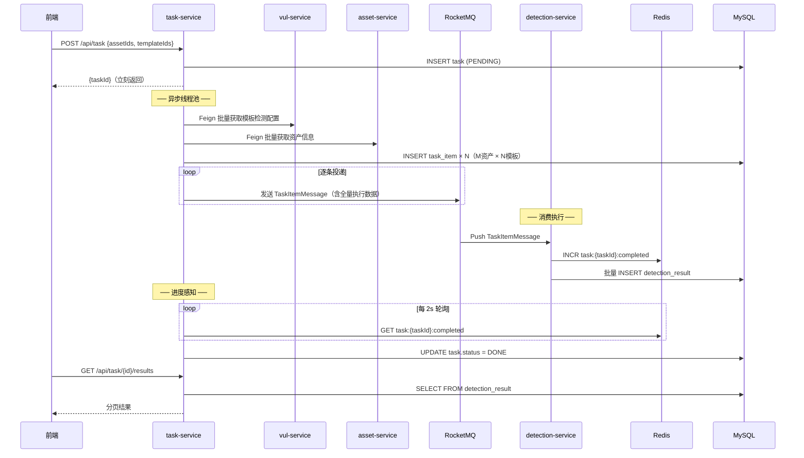
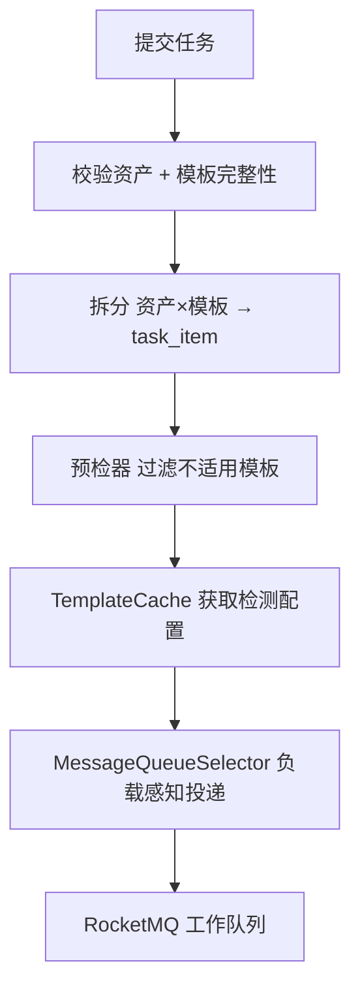

# 任务调度服务（task-service）

**端口：** `:8005`
**状态：** 已完成

---

## 定位

检测任务的**调度核心**。接收用户提交的检测任务 → 同步持久化并立刻返回 → 异步线程池完成校验、拆分（资产 × 模板） → 通过 RocketMQ 负载感知投递 → 定时轮询 Redis 感知任务完成。

## 子模块结构

| 子模块 | 关键类 | 职责 |
|--------|--------|------|
| task-common | `Task`、`TaskItem`（实体）、枚举（TaskStatusEnum、TaskItemStatusEnum）、DTO（TemplateDetectConfig、VulTemplateBrief、AssetBrief）、VO | 实体、DTO、VO |
| task-api | `TaskController` | REST API |
| task-business | `TaskServiceImpl`、`TaskSplitService`、`DefaultTaskItemPreChecker`、`TemplateCache`、`TaskProducerService`、Feign 客户端 | 核心调度逻辑 |
| task-bootstrap | `TaskApplication`、`AsyncConfig`、`TaskConfig` | 启动 + 配置 |

## 数据模型

| 表 | 说明 | 关键字段 |
|----|------|----------|
| `task` | 检测任务 | name, status(PENDING→RUNNING→DONE), total_items, completed_items |
| `task_item` | 检测项 | task_id, template_id, asset_id, status, error_message |

## API 端点

| 方法 | 路径 | 说明 |
|------|------|------|
| POST | `/task` | 提交检测任务（异步，立即返回 taskId） |
| GET | `/task` | 分页查询任务列表 |
| GET | `/task/{id}` | 查询任务详情 + 各检测项状态 |
| GET | `/task/{taskId}/results` | 查询检测结果（分页） |

## 核心流程

## 关键组件

### TaskSplitService（拆分服务）

### TemplateCache（模板缓存）

二级缓存架构：Caffeine L1（本地） + Redis L2（分布式）
- 防缓存穿透：布隆过滤器
- 防缓存击穿：互斥锁
- 防缓存雪崩：随机过期时间

### DefaultTaskItemPreChecker（预检器）

在投递前过滤不适用于当前资产的模板：
- 过滤 OAST 机制模板（外带数据检测不适用常规资产）
- 其他预检规则

### TaskProducerService（消息生产者）

使用 RocketMQ `MessageQueueSelector`，查询 Redis 中 Worker 负载信息，定向投递到当前负载最低的队列。

### 进度轮询

定时任务轮询 Redis 计数器：
- `task:{taskId}:completed` — 已完成数
- `task:{taskId}:failed` — 失败数
- `task:{taskId}:remaining` — 剩余数
- 当 `completed >= total` 时，任务标记为 DONE

## 相关文档

- [API 文档](api/任务调度服务-API.md)
- [SQL](sql/任务调度服务.sql)
- [迁移脚本](sql/任务服务-迁移v3到v4.sql)
