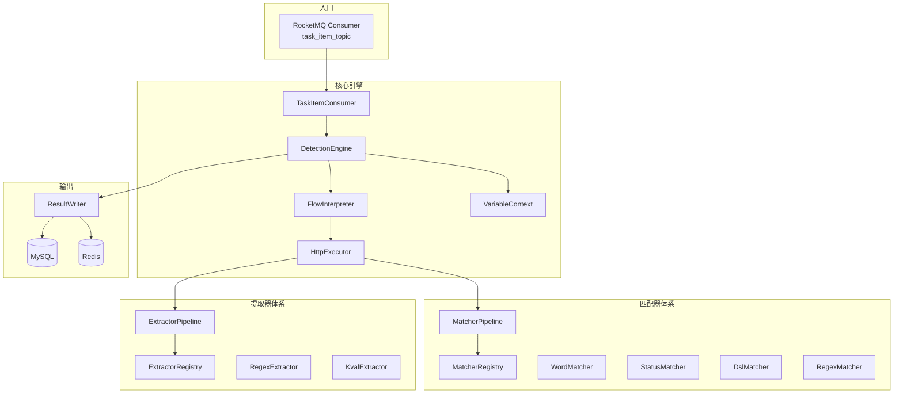

# 检测执行服务（detection-service）

**端口：** `:8006`（健康检查 + Nacos 注册，可多实例水平扩展）
**状态：** 已完成

---

## 定位

检测任务的**执行引擎**。纯 RocketMQ Consumer，不暴露 REST API。消费消息 → 执行 HTTP 探测 + 匹配判定 + 结果提取 → 批量写库 + Redis 计数。

> 每个实例是一个 Worker 节点，无状态，支持多实例水平扩展。

## 子模块结构

| 子模块 | 关键类 | 职责 |
|--------|--------|------|
| detection-common | `TaskItemMessage`（MQ 消息体）、`TaskItemResult`（实体）、枚举（DetectionStatusEnum）、`UrlFixer` | 实体、消息体 |
| detection-business | 核心引擎（见下方引擎组件） | 执行引擎 |
| detection-bootstrap | `DetectionApplication`（非 Web 应用） | 启动类 |

## 引擎组件



### 组件说明

| 组件 | 职责 |
|------|------|
| `TaskItemConsumer` | RocketMQ 监听消费，设置租户上下文 |
| `DetectionEngine` | 编排执行入口 |
| `FlowInterpreter` | 执行流编排，支持模板级 flow 定义（条件分支 + 步骤编排） |
| `VariableContext` | 变量上下文：`{{BaseURL}}` 等占位符替换 + 嵌套变量解析 + 提取器变量回写 |
| `HttpExecutor` | HTTP 请求执行：支持 Simple/Raw 两种模式；HTTPS 失败自动降级 HTTP；空 path 错误处理 |
| `MatcherPipeline` | 匹配器管线，通过 MatcherRegistry 注册匹配器 |
| `ExtractorPipeline` | 提取器管线，通过 ExtractorRegistry 注册提取器 |
| `ResultWriter` | 结果写入：本地缓冲 + 批量 INSERT + Redis INCR 计数 |

## 匹配器体系

| 匹配器 | 实现类 | 说明 |
|--------|--------|------|
| Word | `WordMatcher` | 关键词匹配（body/header/raw），支持大小写敏感 |
| Status | `StatusMatcher` | HTTP 状态码匹配，支持范围 |
| Dsl | `DslMatcher` | Aviator 表达式引擎，`contains()`、`status_code`、`len()` 等 |
| Regex | `RegexMatcher` | 正则匹配响应内容 |

所有匹配器实现 `Matcher` 接口，通过 `MatcherRegistry` 注册，`MatcherPipeline` 统一调度。

## 提取器体系

| 提取器 | 实现类 | 说明 |
|--------|--------|------|
| Regex | `RegexExtractor` | 正则提取（带分组支持） |
| Kval | `KvalExtractor` | 键值提取（Header/Cookie/JSON Body） |

所有提取器实现 `Extractor` 接口，通过 `ExtractorRegistry` 注册，`ExtractorPipeline` 统一调度。提取结果回写到 `VariableContext`。

## 执行流程

```
onMessage(TaskItemMessage msg)
  │
  ├─ DetectionEngine.execute(msg)
  │     ├─ VariableContext 解析变量（BaseURL、模板变量、提取器变量）
  │     ├─ FlowInterpreter 编排执行流
  │     ├─ HttpExecutor 发起 HTTP 请求（Simple/Raw 模式）
  │     ├─ MatcherPipeline 匹配判定（Word → Status → Dsl → Regex）
  │     ├─ ExtractorPipeline 提取响应数据 → 回写 VariableContext
  │     └─ 汇总 → TaskItemResult (matched/not_matched/error)
  │
  ├─ ResultWriter.write(result)
  │     ├─ 本地缓冲
  │     ├─ Redis INCR task:{taskId}:{status}
  │     └─ 缓冲满 或 定时 → 批量 INSERT
  │
  └─ 负载上报: Redis SET worker:load:{workerId}
```

## 错误处理

| 场景 | 行为 |
|------|------|
| 消息反序列化失败 | RocketMQ 自动重试，最终进入 DLQ 死信队列 |
| HTTP 超时 / IOException | `writeError(result)` → 不抛异常 → 不触发重试 |
| 模板/资产数据缺失 | 消息中已含全量数据，不会出现此情况 |
| Redis 不可用 | 降级：跳过 INCR，批量写入仍正常 |
| HTTPS 连接失败 | 自动降级 HTTP 重试 |

## 负载上报

每个 Worker 定期向 Redis 上报状态：
- `worker:load:{workerId}` — 当前负载
- task-service 的 MessageQueueSelector 查询负载信息，定向投递

## 相关文档

- [API 文档](api/检测执行服务-API.md)
- [详细架构](检测执行服务架构.md)
