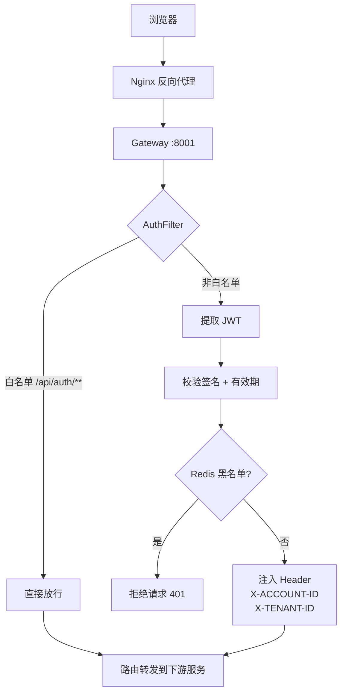
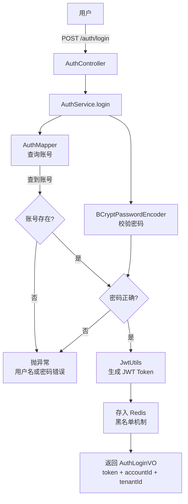
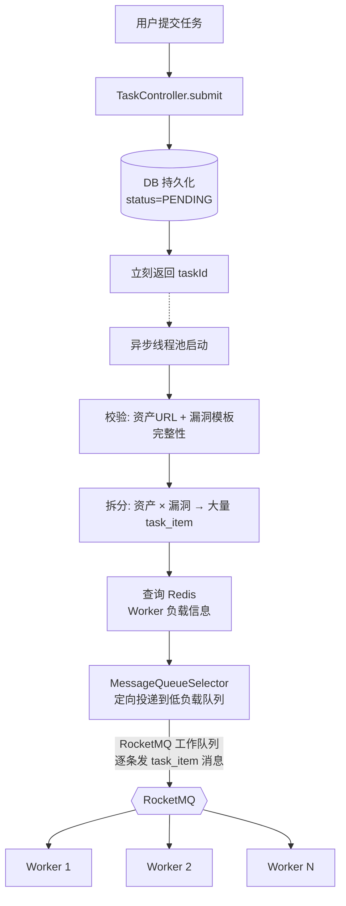
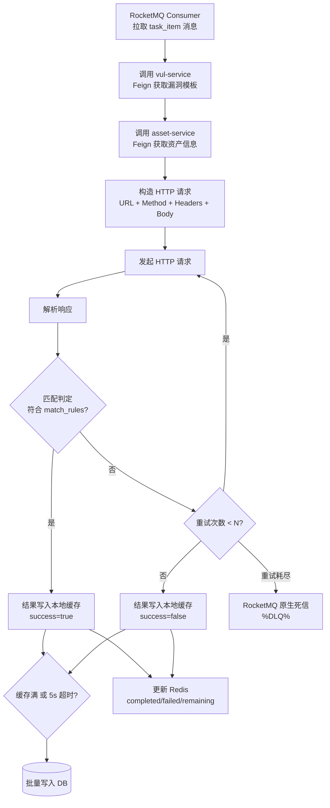
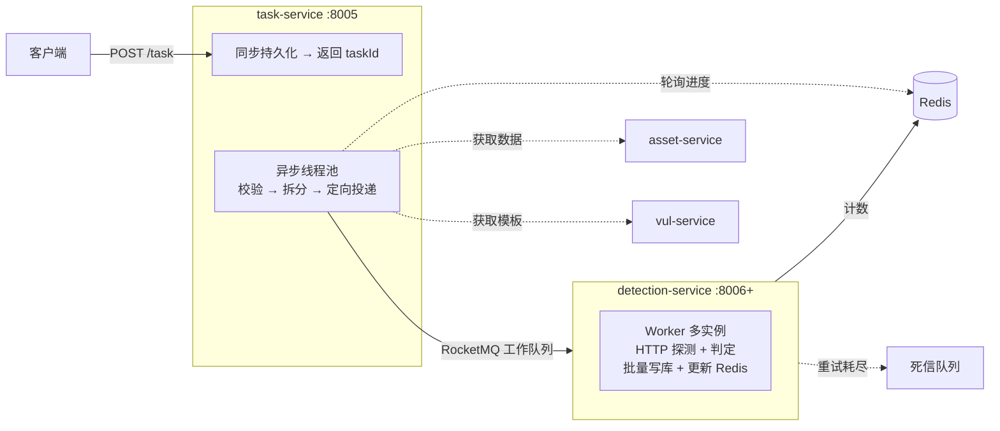
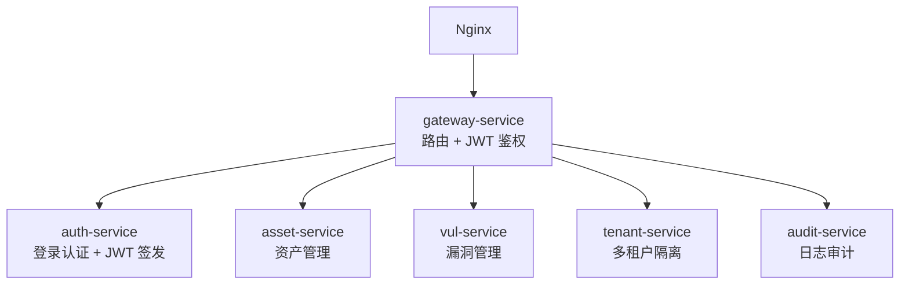

# Hawkeye Cloud — 模块说明

---

## 1. common-service（公共基础设施）

**路径：** `common-service/common-utils/`

**定位：** 所有微服务的公共依赖，提供通用能力和基础设施。

### 核心功能

| 功能              | 类/文件                                           | 说明                                   |
|-----------------|------------------------------------------------|--------------------------------------|
| 统一响应            | `ApiResponse<T>`                               | 全局统一 JSON 响应格式，包含 code、message、data  |
| 业务异常            | `ApiException`                                 | 运行时异常，携带 ErrorCode                   |
| 错误码             | `ErrorCode`                                    | 错误码枚举接口，规范异常分类                       |
| 分页模型            | `ListResult<T>`                                | 封装分页查询结果（records、total、page、size）    |
| 请求上下文           | `RequestContext`                               | ThreadLocal 存储当前请求的租户 ID 等信息         |
| 请求上下文 Filter    | `RequestContextFilter`                         | Servlet Filter，初始化/清理 RequestContext |
| 请求头常量           | `HeaderConstants`                              | Header 名称常量（如 `X-TENANT-ID`）         |
| MyBatis-Plus 配置 | `MybatisPlusConfig`                            | 多租户拦截器 + 分页拦截器                       |
| 自动填充            | `MybatisMetaObjectHandler`                     | 自动填充 create_time、update_time、deleted |
| 多租户拦截器          | `MultiTenantInterceptor`                       | 实现 TenantLineHandler，自动注入 tenant_id  |
| 日志切面            | `@LogExecutionTime` + `LogExecutionTimeAspect` | 方法执行耗时日志                             |

### 公共实体基类 `BaseEntity`

```java
public class BaseEntity {
    private Long id;
    private Long tenantId;
    private LocalDateTime createTime;
    private LocalDateTime updateTime;
    private Integer deleted;       // 逻辑删除: 0-未删除, 1-已删除
    private Long createBy;
    private Long updateBy;
}
```

---

## 2. gateway-service（API 网关）

**路径：** `gateway-service/`

**定位：** 系统统一入口，负责请求路由、鉴权、限流、跨域处理。

### 子模块职责

| 子模块               | 状态     | 关键类                                                                                                 |
|-------------------|--------|-----------------------------------------------------------------------------------------------------|
| gateway-common    | ✅ 完成   | `JwtUtils`（响应式 JWT 校验 + Redis 黑名单）、`JwtToken`（令牌模型）、`GatewayConstants`（常量）                     |
| gateway-business  | ✅ 完成   | `AuthFilter`（全局认证过滤器：白名单放行 + JWT 校验 + accountId/tenantId 请求头注入）                                  |
| gateway-bootstrap | ✅ 完成   | 启动类 + `application.yml`（路由配置、CORS、服务发现、Redis）                                                 |

### 已配置的路由

| 路由              | 目标                   | 说明                             |
|-----------------|----------------------|--------------------------------|
| `/api/auth/**`  | `lb://auth-service`  | 转发到认证服务，StripPrefix=1          |
| `/api/asset/**` | `lb://asset-service` | 转发到资产服务，StripPrefix=1          |

### 认证链路



### 已配置的能力

- **CORS** — 全局配置，允许跨域请求（开发阶段全放行）
- **服务发现** — 开启 `discovery.locator.enabled=true`，支持通过服务名访问
- **Redis** — 响应式 Redis（Lettuce），用于 JWT 黑名单校验（Token 主动失效）

---

## 3. auth-service（认证服务）

**路径：** `auth-service/`

**定位：** 用户认证 + 租户管理（当前仅实现了基础认证功能）。

### 子模块结构

| 子模块            | 包                                 | 关键类                                                                                                                    |
|----------------|-----------------------------------|------------------------------------------------------------------------------------------------------------------------|
| auth-common    | `com.hawkeye.auth.common`         | `Account`（实体）、`AuthLoginVO`（VO）、`JwtUtils`（JWT工具）、`SecurityConfig`（安全配置）、`PasswordEncoderConfig`、`WebMvcConfiguration` |
| auth-api       | `com.hawkeye.auth.api.controller` | `AuthController`                                                                                                       |
| auth-business  | `com.hawkeye.auth.business`       | `AuthService`、`AuthServiceImpl`、`AuthMapper`                                                                           |
| auth-bootstrap | `com.hawkeye.auth`                | `AuthApplication`                                                                                                      |

### API 端点

| 方法   | 路径            | 说明                                 |
|------|---------------|------------------------------------|
| POST | `/auth/login` | 登录，返回 token + accountId + tenantId |

### 认证流程



### 安全配置

当前 Spring Security 配置为全放行（`anyRequest().permitAll()`），后续将添加 JWT 认证过滤器。

---

## 4. asset-service（资产服务）

**路径：** `asset-service/`

**定位：** 资产（目标 URL/域名）的管理、分类、查询，是漏洞检测的数据基础。

### 子模块结构

| 子模块             | 包                                  | 关键类                                                                                                                                                                                                       |
|-----------------|------------------------------------|-----------------------------------------------------------------------------------------------------------------------------------------------------------------------------------------------------------|
| asset-common    | `com.hawkeye.asset.common`         | `Asset`、`AssetCategory`、`AssetCategoryMapping`（实体）、`AssetDTO`、`AssetPageQueryDTO`（DTO）、`PageAssetVO`（VO）、`AssetStatusEnum`、`AssetRiskEnum`、`RequestMethodEnum`（枚举）、`AdditionalScanConfig`、`MyBatisConfig` |
| asset-api       | `com.hawkeye.asset.api.controller` | `AssetController`、`AssetCategoryController`                                                                                                                                                              |
| asset-business  | `com.hawkeye.asset.business`       | `AssetService`、`AssetServiceImpl`、`AssetMapstruct`、`AssetMapper`、`AssetCategoryMapper`、`AssetCategoryMappingMapper`、`AssetCategoryService`、`AssetCategoryServiceImpl`                                   |
| asset-bootstrap | `com.hawkeye.asset`                | `AssetApplication`                                                                                                                                                                                        |

### 数据模型

| 表                        | 说明      | 主要字段                                                                       |
|--------------------------|---------|----------------------------------------------------------------------------|
| `asset`                  | 资产主表    | name, url, request_method, request_host, risk_level, status, category_name |
| `asset_category`         | 资产分类    | name, description                                                          |
| `asset_category_mapping` | 资产-分类关联 | asset_id, category_id                                                      |

### API 端点

#### 资产接口 (AssetController)

| 方法     | 路径                | 说明                                  |
|--------|-------------------|-------------------------------------|
| GET    | `/asset`          | 分页查询资产，支持 name/host/risk/status/category 多条件过滤 |
| POST   | `/asset`          | 创建资产                                |
| GET    | `/asset/{id}`     | 获取资产详情                              |
| PUT    | `/asset/{id}`     | 更新资产                                |
| DELETE | `/asset/{id}`     | 删除资产（有分类关联时拒绝删除）                    |

#### 分类接口 (AssetCategoryController)

| 方法     | 路径                              | 说明                     |
|--------|---------------------------------|------------------------|
| GET    | `/asset-category`               | 查询分类列表（按 parentId + name 筛选） |
| POST   | `/asset-category`               | 创建分类（不传 parentId = 顶级分类）   |
| PUT    | `/asset-category/{id}`          | 更新分类（变更父级时防环校验）         |
| DELETE | `/asset-category/{id}`          | 删除分类（有子分类/关联资产时拒绝）       |
| POST   | `/asset-category/{id}/assets`   | 给分类批量添加资产               |
| DELETE | `/asset-category/{id}/assets`   | 从分类批量移除资产               |

共计 **11 个 API 端点**，已全部实现。

### 枚举定义

- **`AssetStatusEnum`** — `DISABLED("禁用")`, `ENABLED("启用")`, `DEPRECATED("弃用")`
- **`AssetRiskEnum`** — `UNKNOWN("未知")`, `LOW("低危")`, `MEDIUM("中危")`, `HIGH("高危")`
- **`RequestMethodEnum`** — `GET`, `HEAD`, `POST`, `PUT`, `PATCH`, `DELETE`, `OPTIONS`, `TRACE`

> 枚举均实现 MyBatis-Plus `IEnum<Integer>`，通过 `MybatisEnumTypeHandler` 自动与 DB 的 tinyint 互转。

### 关键设计决策

1. **资产与分类多对多** — 通过中间表 `asset_category_mapping` 关联，分页查询分类下资产用 `EXISTS` 子查询避免联表
2. **分类树** — `parent_id IS NULL` 表达顶级分类，前端根据平铺列表自行构建树，不分页
3. **删除保护** — 删除分类前校验无子分类、无关联资产；删除资产前校验无分类关联
4. **变更父分类防环** — 更新 parentId 时校验目标父节点不能是当前节点的子孙

---

## 5. vul-service（漏洞管理服务）—— 规划中

**路径：** `vul-service/`

**定位：** 管理漏洞检测模板（POC = Proof of Concept），定义"检测什么"和"怎么检测"。是核心检测链路的**知识库**。

### 子模块规划

| 子模块          | 职责                         |
|--------------|----------------------------|
| vul-common   | 实体（VulTemplate）、枚举、DTO、配置   |
| vul-api      | 漏洞模板 CRUD 控制器               |
| vul-business | 漏洞模板业务逻辑、Mapper             |
| vul-bootstrap | 启动类 + application.yml      |

### 预期数据模型

| 表       | 说明     | 关键字段                                                     |
|---------|--------|----------------------------------------------------------|
| `vul_template`   | 漏洞模板 | name, description, risk_level, request_template, match_rules, category_id |
| `vul_category` | 漏洞分类 | name, parent_id (树形，参考 asset_category)                 |

### 预期 API

| 方法  | 路径                  | 说明           |
|-----|---------------------|--------------|
| GET | `/vul`              | 分页查询漏洞模板列表  |
| POST | `/vul`              | 创建漏洞模板       |
| PUT | `/vul/{id}`         | 更新漏洞模板       |
| DELETE | `/vul/{id}`         | 删除漏洞模板       |
| GET | `/vul/{id}`         | 获取漏洞模板详情    |

---

## 6. task-service（任务服务）—— 规划中

**路径：** `task-service/`

**定位：** 检测任务的**调度入口**。负责接收用户提交的检测任务、同步持久化后立刻返回，内部异步线程池完成校验、拆分（资产 × 漏洞模板）、通过 RocketMQ 按负载感知策略定向投递到检测节点。通过定时轮询 Redis 感知任务完成。

### 子模块规划

| 子模块           | 职责                              |
|---------------|---------------------------------|
| task-common   | 实体（Task、TaskItem）、枚举、DTO、RocketMQ Producer |
| task-api      | Controller：任务提交、查询、取消           |
| task-business | 核心逻辑：校验、拆分、分发、状态管理             |
| task-bootstrap | 启动类 + application.yml           |

### 预期数据模型

| 表          | 说明    | 关键字段                                  |
|------------|-------|---------------------------------------|
| `task`     | 检测任务  | name, status, total_items, completed_items, created_by |
| `task_item` | 检测组合  | task_id, asset_id, vul_id, status, result |

### 预期 API

| 方法  | 路径               | 说明                |
|-----|------------------|-------------------|
| POST | `/task`          | 提交检测任务（异步，立即返回任务ID）  |
| GET | `/task/{id}`     | 查询任务详情 + 各检测项状态    |
| GET | `/task`          | 分页查询任务列表          |
| DELETE | `/task/{id}`     | 取消任务（仅限未开始的任务）    |

### 核心链路（task-service 内部编排）




---

## 7. detection-service（检测服务）—— 规划中

**路径：** `detection-service/`

**定位：** 检测任务的**执行引擎**。每个实例是一个 Worker 节点，消费 RocketMQ 中的检测组合消息，根据漏洞模板发起 HTTP 请求并判定结果，结果本地缓存后批量写库并更新 Redis 计数。支持多实例水平扩展。

> **注意：** 检测服务不需要暴露 REST API（无 Controller 层），只作为 RocketMQ Consumer 运行。可多实例部署实现水平扩展。

### 子模块规划

| 子模块              | 职责                           |
|------------------|------------------------------|
| detection-common | 实体（DetectionResult）、DTO、RocketMQ Consumer 配置 |
| detection-business | 核心执行引擎：漏洞模板匹配 → HTTP 请求 → 响应匹配判定 |
| detection-bootstrap | 启动类 + application.yml（无 Controller 层） |

### 预期数据模型

| 表                | 说明    | 关键字段                                       |
|------------------|-------|--------------------------------------------|
| `detection_result` | 检测结果  | task_item_id, success, response_body, error_message, duration_ms |

### 核心链路（detection-service Worker 执行）



### 负载上报

每个 Worker 以 5s 间隔向 Redis 上报状态：
```json
{
  "workerId": "worker-1",
  "queueSize": 23,
  "activeThreads": 12,
  "maxThreads": 32,
  "lastReportTime": 1716875300000
}
```


---

## 8. tenant-service（租户服务）—— 规划中

**路径：** `tenant-service/`

**定位：** 管理多租户（SaaS 隔离），提供租户的 CRUD、配额管理。与 auth-service 解耦——认证管"谁能登录"，租户管"谁有权限看什么数据"。

### 子模块规划

| 子模块            | 职责                      |
|----------------|-------------------------|
| tenant-common  | 实体（Tenant）、DTO、配置      |
| tenant-api     | Controller：租户 CRUD     |
| tenant-business | Service + Mapper 层     |
| tenant-bootstrap | 启动类 + application.yml  |

### 预期数据模型

| 表        | 说明   | 关键字段                              |
|----------|------|-----------------------------------|
| `tenant` | 租户信息 | name, contact_email, status, max_assets, max_users |

### 预期 API

| 方法  | 路径              | 说明        |
|-----|-----------------|-----------|
| GET | `/tenant`       | 分页查询租户列表 |
| POST | `/tenant`       | 创建租户     |
| PUT | `/tenant/{id}`  | 更新租户     |
| DELETE | `/tenant/{id}`  | 删除租户     |


---

## 9. audit-service（日志审计服务）—— 规划中

**路径：** `audit-service/`

**定位：** 记录系统操作日志和安全审计信息，满足合规要求。

### 子模块规划

| 子模块            | 职责                       |
|----------------|--------------------------|
| audit-common   | 实体（AuditLog）、DTO、配置     |
| audit-api      | Controller：日志查询         |
| audit-business | Service + Mapper 层      |
| audit-bootstrap | 启动类 + application.yml   |

### 预期数据模型

| 表          | 说明   | 关键字段                                |
|------------|------|-------------------------------------|
| `audit_log` | 审计日志 | operator_id, operation, target, detail, ip, create_time |

### 预期 API

| 方法  | 路径        | 说明           |
|-----|-----------|--------------|
| GET | `/audit`  | 分页查询审计日志（按操作人、时间范围等过滤） |


---

## 服务分类总结

### 核心模块（检测链路）



### 基础模块（支撑平台）



请参见 `docs/任务调度系统架构.md` 获取核心链路的详细架构设计。
