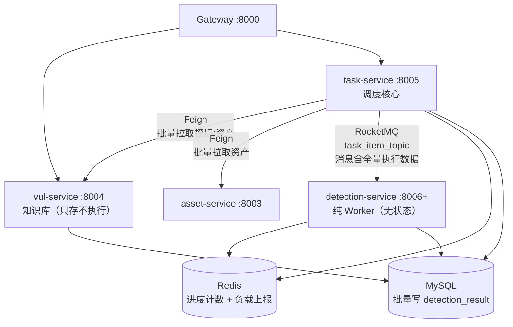
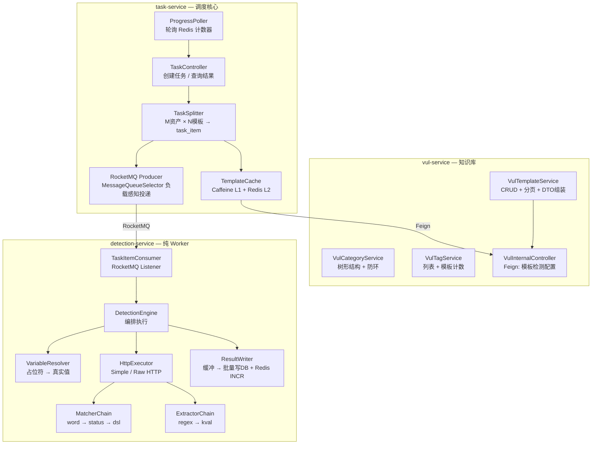
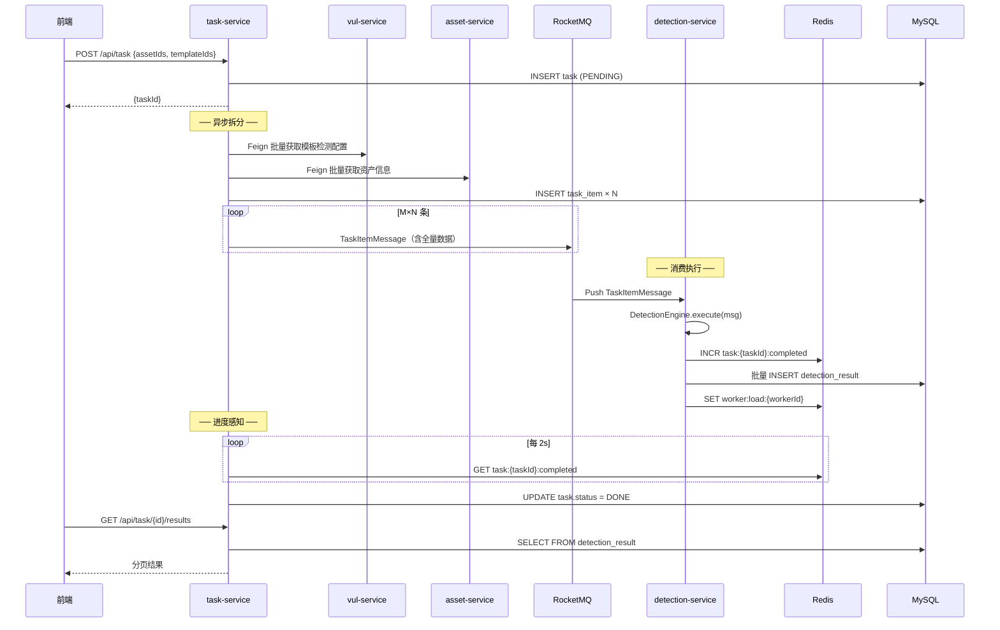

# 漏洞管理服务 & 检测服务 & 任务调度 — 接口与架构设计 v2.0

> task-service 是调度核心，vul-service 是知识库，detection-service 是纯执行 Worker。

---

## 一、整体交互



**调用关系：**
- 前端 → Gateway → vul-service（模板 CRUD）
- 前端 → Gateway → task-service（创建任务 / 查询结果）
- task-service → Feign → vul-service（拉取模板检测配置 + 模板缓存）
- task-service → Feign → asset-service（拉取资产信息）
- task-service → RocketMQ → detection-service（消息含全量数据，Worker 零外部依赖）
- detection-service → Redis（实时 INCR 进度计数 + 定时上报负载）
- detection-service → 批量写 detection_result 表
- task-service → 轮询 Redis 计数器感知进度 → 前端查详情时查 DB

---

## 二、Vul-Service API

Base path: `/api/vul`

### 2.1 模板管理

#### `GET /api/vul/templates` — 分页列表

```
Query:
  page        int    default=1
  size        int    default=20
  name        String 模糊搜索名称
  severity    String 精确过滤（critical/high/medium/low/info）
  tag         String 按标签名过滤
  categoryId  Long   按分类过滤
  enabled     Boolean 按启用状态过滤
  sort        String default=create_time_desc  (create_time_desc/name_asc/severity_asc)

Response:
  {
    "total": 10686,
    "pages": 535,
    "records": [
      {
        "id": 1,
        "templateId": "cve-2024-0012",
        "name": "PAN-OS Management Web Interface - Authentication Bypass",
        "severity": "critical",
        "cveId": "CVE-2024-0012",
        "cvssScore": 9.80,
        "tags": ["cve", "cve2024", "paloalto", "vuln"],
        "categories": ["cves"],
        "enabled": true,
        "version": 1,
        "createTime": "2026-04-30T13:20:00"
      }
    ]
  }
```

列表不返回 `httpSteps`/`matchers`/`extractors`/`references`/`description`，点击详情时单独加载。

#### `GET /api/vul/templates/{id}` — 详情

```
Response:
  {
    "id": 1,
    "templateId": "cve-2024-0012",
    "name": "...",
    "description": "...",
    "author": "johnk3r,watchtowr",
    "severity": "critical",
    "cveId": "CVE-2024-0012",
    "cweId": "CWE-306",
    "cvssScore": 9.80,
    "epssScore": 0.94285,
    "flow": null,
    "variables": {"verified": true, "max-request": 1},
    "enabled": true,
    "tags": ["cve", "cve2024", "paloalto", "globalprotect", "kev", "vuln"],
    "references": [
      { "url": "https://security.paloaltonetworks.com/CVE-2024-0012", "title": null }
    ],
    "categories": ["cves"],
    "httpSteps": [
      {
        "stepOrder": 1,
        "method": null,
        "path": null,
        "raw": "GET /php/ztp_gate.php/.js.map HTTP/1.1\nHost: {{Hostname}}\nX-PAN-AUTHCHECK: off",
        "attack": null,
        "matchersCondition": "and",
        "matchers": [
          {
            "type": "dsl",
            "part": null,
            "condition": "and",
            "negative": false,
            "caseInsensitive": false,
            "name": null,
            "config": {
              "dsl": [
                "contains_any(body, \"<title>Zero Touch Provisioning\", \"Zero Touch Provisioning (ZTP)\")",
                "contains(body, \"/scripts/cache/mainui.javascript\")",
                "contains(header, \"PHPSESSID=\")",
                "status_code == 200"
              ]
            }
          }
        ],
        "extractors": []
      }
    ]
  }
```

#### `POST /api/vul/templates` — 创建

```
Body:
  {
    "templateId": "custom-001",       // 必填，唯一
    "name": "自定义检测",               // 必填
    "description": "...",             // 可选
    "author": "...",                  // 可选
    "severity": "high",               // 必填
    "cveId": null,
    "cweId": null,
    "cvssScore": null,
    "epssScore": null,
    "flow": null,
    "variables": {"key": "val"},
    "tags": ["custom", "test"],       // 标签名列表，不存在的自动创建
    "references": [
      { "url": "https://...", "title": "参考" }
    ],
    "categoryIds": [1, 2],            // 关联已有分类
    "httpSteps": [
      {
        "method": "GET",
        "path": ["{{BaseURL}}/admin"],
        "headers": {"User-Agent": "..."},
        "body": null,
        "raw": null,
        "attack": null,
        "matchersCondition": "or",
        "matchers": [...],
        "extractors": [...]
      }
    ]
  }

Response: ApiResponse<Long>  (返回新模板 id)
```

#### `PUT /api/vul/templates/{id}` — 更新（部分更新）

```
Body: 同创建，但所有字段可选。null 字段不更新。

Response: ApiResponse<Void>
```

#### `DELETE /api/vul/templates/{id}` — 软删除

```
Response: ApiResponse<Void>
```
- 如有分类关联，应先拒绝（与 asset 行为一致，参考 REVIEW §2.2）

#### `PATCH /api/vul/templates/{id}/enabled` — 快速启用/禁用

```
Body: { "enabled": false }
Response: ApiResponse<Void>
```

#### `POST /api/vul/templates/batch-delete` — 批量删除

```
Body: { "ids": [1, 2, 3] }
Response: ApiResponse<Integer>  (返回实际删除数)
```

### 2.2 标签管理

#### `GET /api/vul/tags` — 标签列表

```
Query:
  keyword  String  模糊搜索（可选）

Response:
  [
    { "id": 1, "name": "cve", "templateCount": 5231 },
    { "id": 2, "name": "rce", "templateCount": 891 },
    ...
  ]
```

标签只读 — 由模板的 tags 字段导入时自动创建，不提供手动 CRUD。

### 2.3 分类管理

#### `GET /api/vul/categories` — 分类树

```
Query:
  parentId  Long  只查某个父节点下的子节点（可选，不传返回全部）

Response:
  [
    {
      "categoryId": 1,
      "name": "cves",
      "parentId": null,
      "sortOrder": 0,
      "description": null,
      "templateCount": 5231,
      "children": [
        { "categoryId": 5, "name": "2024", "parentId": 1, ... }
      ]
    }
  ]
```

#### `POST /api/vul/categories` — 创建

```
Body:
  {
    "name": "新分类",
    "parentId": null,
    "sortOrder": 0,
    "description": "..."
  }
Response: ApiResponse<Long>
```

#### `PUT /api/vul/categories/{id}` — 更新

```
Body: 同创建，含防循环检查（不能把 parentId 设为自己的子孙节点）
```

#### `DELETE /api/vul/categories/{id}` — 删除

- 有子节点或有关联模板时拒绝

#### `POST /api/vul/categories/{id}/templates` — 批量关联模板

```
Body: { "templateIds": [1, 2, 3] }
Response: ApiResponse<Integer>
```

#### `DELETE /api/vul/categories/{id}/templates` — 批量取消关联

```
Body: { "templateIds": [1, 2] }
```

#### `GET /api/vul/categories/{id}/templates` — 分类下模板列表（分页）

```
Query: page, size
Response: 分页模板列表（同模板列表格式）
```

### 2.4 内部 Feign 接口（task-service 调用，拆分任务时拉取模板检测配置）

#### `GET /api/vul/internal/templates/{id}` — 获取检测配置

```
Response: VulTemplateDetectDTO
  {
    "templateId": "cve-2024-0012",       // 业务ID，用于日志
    "flow": null,                         // 执行流
    "variables": {"verified": true},      // 模板变量（JSON对象）
    "httpSteps": [                        // 精简：只含执行所需字段
      {
        "stepOrder": 1,
        "method": null,
        "path": null,
        "headers": null,
        "body": null,
        "raw": "GET /php/ztp_gate.php...",
        "attack": null,
        "matchersCondition": "and",
        "matchers": [
          {
            "type": "dsl",
            "part": null,
            "condition": "and",
            "negative": false,
            "caseInsensitive": false,
            "config": { "dsl": [...] }
          }
        ],
        "extractors": []
      }
    ]
  }
```

只含检测执行必需的字段，不含 name/description/CVE 等元数据。

#### `POST /api/vul/internal/templates/batch` — 批量获取

```
Body: { "ids": [1, 2, 3] }
Response: List<VulTemplateDetectDTO>
```

---

## 三、Detection-Service — 纯 Worker（无 REST API）

detection-service 不暴露 REST 接口。它是纯 RocketMQ Consumer，启动后等待消息执行。

### 3.1 消息入口

```
RocketMQ Listener: TaskItemConsumer
  Topic: task_item_topic
  ConsumerGroup: task_item_consumer_group
  模式: CLUSTERING（同一条消息只被一个 Worker 消费）
  最大线程: 64
  重试: 16 次 + 递增延迟 → %DLQ% 死信
```

### 3.2 执行流程

```
onMessage(TaskItemMessage msg)
  │
  ├─ DetectionEngine.execute(msg)
  │     │
  │     ├─ 从 msg 取资产信息 → 构建 VariableResolver
  │     ├─ 从 msg 取 httpSteps → 逐步骤执行
  │     │     ├─ HttpExecutor.execute / executeRaw
  │     │     ├─ ExtractorChain.extract（变量写回 resolver）
  │     │     └─ MatcherChain.match（匹配判定）
  │     │
  │     └─ 汇总 → DetectionResult（status=matched/not_matched/error）
  │
  ├─ ResultWriter.write(result)
  │     ├─ buffer.add(result)
  │     ├─ Redis INCR task:{taskId}:{status}
  │     └─ buffer.size ≥ 500 || 5s → 批量 INSERT detection_result
  │
  └─ 每 5s: Redis SET worker:load:{workerId}（负载上报）
```

### 3.3 错误处理

| 场景 | 行为 |
|------|------|
| 消息反序列化失败 | RocketMQ 自动重试，最终进入 DLQ |
| HTTP 超时 / IOException | `writeError(result)` → 不抛异常 → 不触发重试 |
| 模板/资产数据缺失 | 消息中已含全量数据，不会出现此情况 |
| Redis 不可用 | 降级：跳过 INCR，批量写入仍正常 |

### 3.4 组件清单

| 组件 | 职责 |
|------|------|
| `TaskItemConsumer` | RocketMQ 监听，设置租户上下文 |
| `DetectionEngine` | 编排执行：变量解析 → HTTP 探测 → 提取 → 匹配 |
| `HttpExecutor` | Java HttpClient，支持 Simple/Raw 两种模式 |
| `VariableResolver` | `{{BaseURL}}` 等占位符替换 |
| `MatcherChain` | Word / Status / Dsl 三种匹配器责任链 |
| `ExtractorChain` | Regex / Kval 提取器 |
| `ResultWriter` | 本地缓冲 + 批量写 DB + Redis INCR |
| `DetectionResultMapper` | MyBatis-Plus 写入 detection_result 表 |

---

## 四、DTO 定义

### 4.1 Vul-Service VO

```java
// ── 模板列表项 ──
@Data
public class VulTemplatePageResponse {
    private Long id;
    private String templateId;
    private String name;
    private String severity;
    private String cveId;
    private BigDecimal cvssScore;
    private List<String> tags;          // 从 vul_template_tag JOIN vul_tag 组装
    private List<String> categories;    // 从 vul_template_category JOIN vul_category 组装
    private Boolean enabled;
    private Integer version;
    private LocalDateTime createTime;
}

// ── 模板详情 ──
@Data
public class VulTemplateDetailResponse {
    private Long id;
    private String templateId;
    private String name;
    private String description;
    private String author;
    private String severity;
    private String cveId;
    private String cweId;
    private BigDecimal cvssScore;
    private BigDecimal epssScore;
    private String flow;
    private Map<String, Object> variables;   // JSON → Map
    private Boolean enabled;
    private Integer version;
    private List<String> tags;
    private List<ReferenceVO> references;
    private List<CategoryBriefVO> categories;
    private List<HttpStepVO> httpSteps;
    private LocalDateTime createTime;
    private LocalDateTime updateTime;

    @Data
    public static class ReferenceVO { String url; String title; }
    @Data
    public static class CategoryBriefVO { Long categoryId; String name; }
    @Data
    public static class HttpStepVO {
        private Integer stepOrder;
        private String method;
        private List<String> path;          // JSON → List
        private Map<String, String> headers; // JSON → Map
        private String body;
        private String raw;
        private String attack;
        private String matchersCondition;
        private List<MatcherVO> matchers;
        private List<ExtractorVO> extractors;
    }
    @Data
    public static class MatcherVO {
        private String type;
        private String part;
        private String condition;
        private Boolean negative;
        private Boolean caseInsensitive;
        private String name;
        private Map<String, Object> config;  // JSON → Map
    }
    @Data
    public static class ExtractorVO {
        private String type;
        private String part;
        private String name;
        private Map<String, Object> config;
        private Boolean internal;
        private Integer groupNum;
    }
}

// ── 模板创建/更新请求 ──
@Data
public class VulTemplateRequest {
    @NotBlank private String templateId;
    @NotBlank private String name;
    private String description;
    private String author;
    @NotBlank @SeverityValid private String severity;  // 自定义校验
    private String cveId;
    private String cweId;
    @DecimalMax("10.0") @DecimalMin("0.0") private BigDecimal cvssScore;
    @DecimalMax("1.0") @DecimalMin("0.0") private BigDecimal epssScore;
    private String flow;
    private Map<String, Object> variables;
    private List<String> tags;
    private List<ReferenceRequest> references;
    private List<Long> categoryIds;
    @NotEmpty private List<HttpStepRequest> httpSteps;

    @Data
    public static class ReferenceRequest {
        @NotBlank private String url;
        private String title;
    }
    @Data
    public static class HttpStepRequest {
        private String method;
        private List<String> path;
        private Map<String, String> headers;
        private String body;
        private String raw;
        private String attack;
        private String matchersCondition;
        private List<MatcherRequest> matchers;
        private List<ExtractorRequest> extractors;
    }
    @Data
    public static class MatcherRequest {
        @NotBlank private String type;
        private String part;
        private String condition;
        private Boolean negative;
        private Boolean caseInsensitive;
        private String name;
        private Map<String, Object> config;
    }
    @Data
    public static class ExtractorRequest {
        @NotBlank private String type;
        private String part;
        private String name;
        private Map<String, Object> config;
        private Boolean internal;
        private Integer groupNum;
    }
}

// ── 分页查询请求 ──
@Data
public class VulTemplatePageRequest {
    private Integer page = 1;
    private Integer size = 20;
    private String name;
    private String severity;
    private String tag;
    private Long categoryId;
    private Boolean enabled;
    private String sort = "create_time_desc";
}

// ── 分类响应 ──
@Data
public class VulCategoryResponse {
    private Long categoryId;
    private String name;
    private Long parentId;
    private Integer sortOrder;
    private String description;
    private Long templateCount;
    private List<VulCategoryResponse> children;
}

// ── 标签响应 ──
@Data
public class VulTagResponse {
    private Long id;
    private String name;
    private Long templateCount;
}
```

### 4.2 检测相关 DTO（task ↔ detection 共享消息体）

```java
// ── RocketMQ 消息体（task-service 投递 → detection-service 消费）──
// 位于 detection-common，task-service 编译时依赖此模块
@Data
public class TaskItemMessage implements Serializable {
    private Long taskId;
    private Long itemId;
    private Long tenantId;
    private Long createdAt;

    // 资产信息（VariableResolver 用）
    private String assetProtocol;
    private String assetHost;
    private Integer assetPort;
    private String assetPath;

    // 模板检测配置
    private String templateId;
    private String flow;
    private Map<String, Object> variables;
    private List<HttpStep> httpSteps;

    @Data
    public static class HttpStep {
        private Integer stepOrder;
        private String method;
        private List<String> path;
        private Map<String, String> headers;
        private String body;
        private String raw;
        private String attack;
        private String matchersCondition;
        private List<Matcher> matchers;
        private List<Extractor> extractors;
    }

    @Data
    public static class Matcher {
        private String type;
        private String part;
        private String condition;
        private Boolean negative;
        private Boolean caseInsensitive;
        private Map<String, Object> config;
    }

    @Data
    public static class Extractor {
        private String type;
        private String part;
        private String name;
        private Map<String, Object> config;
        private Boolean internal;
        private Integer groupNum;
    }
}

// ── 检测配置 DTO（vul-service Feign 返回给 task-service） ──
@Data
public class VulTemplateDetectDTO {
    private String templateId;
    private String flow;
    private Map<String, Object> variables;
    private List<HttpStepDetect> httpSteps;

    @Data
    public static class HttpStepDetect {
        private Integer stepOrder;
        private String method;
        private List<String> path;
        private Map<String, String> headers;
        private String body;
        private String raw;
        private String attack;
        private String matchersCondition;
        private List<MatcherDetect> matchers;
        private List<ExtractorDetect> extractors;
    }
    @Data
    public static class MatcherDetect {
        private String type;
        private String part;
        private String condition;
        private Boolean negative;
        private Boolean caseInsensitive;
        private Map<String, Object> config;
    }
    @Data
    public static class ExtractorDetect {
        private String type;
        private String part;
        private String name;
        private Map<String, Object> config;
        private Boolean internal;
        private Integer groupNum;
    }
}

// ── 检测结果查询 ──
@Data
public class DetectionResultPageRequest {
    @NotNull private Long taskId;
    private String status;
    private Long templateId;
    private Long assetId;
    private Integer page = 1;
    private Integer size = 20;
}

// ── 检测结果响应 ──
@Data
public class DetectionResultResponse {
    private Long id;
    private Long taskId;
    private Long taskItemId;
    private Long templateId;
    private String templateName;    // 冗余展示
    private Long assetId;
    private String status;
    private Integer responseStatusCode;
    private Integer durationMs;
    private String matchedMatcher;
    private LocalDateTime matchedAt;
    private String responseSummary;
    private String errorMessage;
}

// ── 手动验证请求 ──
@Data
public class DetectionVerifyRequest {
    @NotNull private Long templateId;
    @NotBlank private String assetUrl;
}

// ── 手动验证响应 ──
@Data
public class DetectionVerifyResponse {
    private String status;
    private Integer responseStatusCode;
    private Integer durationMs;
    private String matchedMatcher;
    private String responseSummary;
    private String errorMessage;
}
```

---

## 五、Service 层设计

### 5.1 Vul-Service



---

## 六、检测引擎执行流程



---

## 七、实施优先级

| 优先级 | 服务 | 模块 | 内容 |
|--------|------|------|------|
| P0 | vul | Entity 层 | 10 个新 Entity + 修复 VulSeverityEnum |
| P0 | vul | Mapper 层 | 10 个 Mapper + VulTemplateMapper 自定义查询 |
| P0 | vul | Service 层 | VulTemplateService CRUD + TagService + CategoryService |
| P0 | vul | Controller | 模板/标签/分类 API + 校验注解 |
| P0 | vul | Assembly | 详情 DTO 组装（多表 → VO） |
| P0 | vul | Feign | VulTemplateDetectDTO 组装 + `/internal/` 端点（供 task-service 调用） |
| P1 | detect | 骨架 | detection-service 模块 — maven + yml + 启动类（非 Web，CountDownLatch） |
| P1 | detect | Engine | VariableResolver + HttpExecutor + MatcherChain (3种) + ExtractorChain |
| P1 | detect | Consumer | RocketMQ PushConsumer + 重试/死信 |
| P1 | detect | ResultWriter | 本地缓冲 + 批量写 + Redis INCR + 负载上报 |
| P1 | task | 骨架 | task-service 模块 — maven + yml + task/task_item DDL |
| P1 | task | API | 创建任务 + 结果查询 API |
| P1 | task | 拆分 | 模板缓存(Caffeine+Redis) + M×N 拆分 + RocketMQ Producer |
| P1 | task | 进度 | Redis 计数器轮询 → task.status = DONE |
| P2 | detect | Engine | Size/Regex/Xpath matchers |
| P2 | task | 分发 | Worker 负载感知投递（MessageQueueSelector） |
| P2 | vul | Controller | 批量操作 + 完善校验 |
