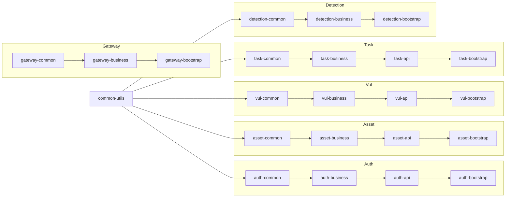
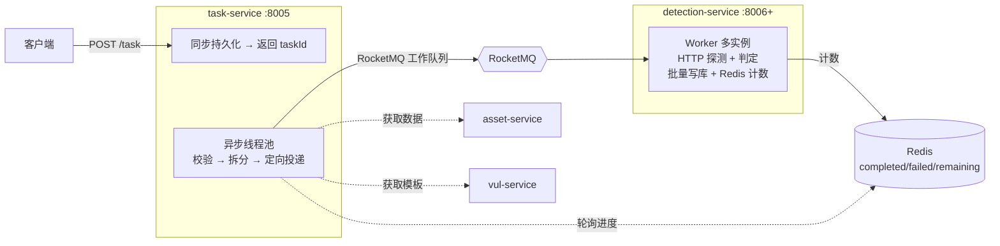

# Hawkeye Cloud — 项目概览

## 项目定位

Hawkeye Cloud 是一个**分布式漏洞检测平台**，采用微服务架构设计，支持**多租户 SaaS 部署**。目标是为企业用户提供可扩展、高可用的资产安全检测服务。

---

## 技术栈

| 类别 | 技术 | 版本 |
|------|------|------|
| 语言 | Java | 21 |
| 框架 | Spring Boot | 4.0.5 |
| 微服务 | Spring Cloud + Spring Cloud Alibaba (Nacos) | 2025.1.0 |
| ORM | MyBatis-Plus | 3.5.15 |
| 数据库 | MySQL + Druid | 9.1.0 |
| 缓存 | Redis / Redisson / Caffeine | - |
| 消息队列 | Apache RocketMQ | 5.3.3 |
| 表达式引擎 | Aviator | 5.4.3 |
| 对象映射 | MapStruct | 1.6.3 |
| JWT | JJWT | 0.12.6 |
| 测试 | JUnit 5 + Mockito + Testcontainers | - |
| 容器 | Docker + Docker Compose | - |

---

## 项目结构

```
hawkeye-cloud/
├── common-service/          # 公共基础设施
│   └── common-utils/        # 统一响应、异常、多租户、MyBatis-Plus 配置
├── gateway-service/         # 网关服务
│   ├── gateway-common/      # JWT 工具类、常量
│   ├── gateway-business/    # AuthFilter 全局认证过滤器
│   └── gateway-bootstrap/   # 网关启动器 (:8001)
├── auth-service/            # 认证服务
│   ├── auth-common/         # 实体、JWT 工具
│   ├── auth-api/            # Controller 层
│   ├── auth-business/       # Service + Mapper 层
│   └── auth-bootstrap/      # 启动器 (:8002)
├── asset-service/           # 资产服务
│   ├── asset-common/        # 实体、枚举、DTO
│   ├── asset-api/           # Controller 层
│   ├── asset-business/      # Service + Mapper + MapStruct
│   └── asset-bootstrap/     # 启动器 (:8003)
├── vul-service/             # 漏洞管理服务
│   ├── vul-common/          # 实体、枚举、DTO/VO
│   ├── vul-api/             # Controller 层
│   ├── vul-business/        # Service + Mapper + MapStruct
│   └── vul-bootstrap/       # 启动器 (:8004)
├── task-service/            # 任务调度服务
│   ├── task-common/         # 实体、枚举、DTO、MQ Producer
│   ├── task-api/            # Controller 层
│   ├── task-business/       # 校验 + 拆分 + 分发 + 缓存
│   └── task-bootstrap/      # 启动器 (:8005)
├── detection-service/       # 检测执行服务
│   ├── detection-common/    # 实体、DTO、MQ Consumer 配置
│   ├── detection-business/  # HTTP 探测 + 匹配引擎
│   └── detection-bootstrap/ # 启动器（可多实例）(:8006+)
├── web-admin/               # 前端管理界面
├── docs/                    # 项目文档
└── pom.xml                  # 根 POM（聚合模块 + 依赖管理）
```

### 服务分类

| 类别 | 服务 | 端口 | 说明 |
|------|------|------|------|
| 核心 | asset-service | 8003 | 资产（扫描目标）管理 |
| 核心 | vul-service | 8004 | 漏洞检测模板（POC）管理 |
| 核心 | task-service | 8005 | 任务调度：提交 → 拆分 → 分发 |
| 核心 | detection-service | 8006+ | 检测 Worker：HTTP 探测 + 结果判定 |
| 基础 | auth-service | 8002 | 认证 + JWT 签发 |
| 基础 | gateway-service | 8001 | API 网关：路由 + JWT 鉴权 + CORS |

---

## 模块依赖关系



- `common-utils` 是所有业务模块的公共依赖
- 每个服务按 **common → business → api → bootstrap** 四层分包
- **核心检测链路**：`task-service` 调用 `vul-service`（获取漏洞模板）和 `asset-service`（获取资产信息），拆分后通过 RocketMQ 分发给 `detection-service`

---

## 开发进度

| 模块 | 状态 | 说明 |
|------|------|------|
| common-service | ✅ 完成 | 统一响应、多租户、MyBatis-Plus 配置、全局异常处理、日志切面 |
| gateway-service | ✅ 完成 | 路由转发 + JWT 过滤器 + CORS + Redis 黑名单 |
| auth-service | ✅ 完成 | 登录认证、JWT 签发、BCrypt 密码加密 |
| asset-service | ✅ 完成 | 资产 CRUD + 分页 + 分类树管理 |
| vul-service | ✅ 完成 | 模板 CRUD + YAML 导入 + 分类 + 标签 + Feign 内部接口 |
| task-service | ✅ 完成 | 任务调度：提交 → 拆分 → RocketMQ 分发 → 轮询 Redis 进度 |
| detection-service | ✅ 完成 | Worker：HTTP 探测 + 匹配引擎（Word/Status/Dsl/Regex）+ 批量写库 |
| web-admin | ✅ 完成 | 前端管理界面：任务面板 + 模板导入 + 分类管理 |

---

## 核心检测链路



## 通用能力

- **统一响应格式** — `ApiResponse<T>` + 业务异常 `ApiException` + 错误码 `ErrorCode`
- **统一分页模型** — `ListResult<T>` 封装分页返回
- **多租户支持** — 基于 MyBatis-Plus 的 `TenantLineHandler`，从请求头 `X-TENANT-ID` 自动注入
- **自动填充** — `MetaObjectHandler` 自动填充 `create_time`、`update_time`、`deleted_at`
- **日志切面** — `@LogExecutionTime` 注解 + AOP 实现方法执行耗时统计
- **MapStruct 映射** — 实体 ↔ DTO ↔ VO 对象转换
